# Capítulo II: Requirements Development and Software Solution Design
## 2.1. Competidores

Para el análisis competitivo de Tata se identificaron tres soluciones digitales relacionadas con el cuidado remoto y la adherencia al tratamiento médico de personas mayores. Se consideraron competidores directos cuyo nucleo del producto sea el recordatorio de medicación con alertas al cuidador, así como un competidor indirecto orientado a la coordinación familiar del cuidado en general.

**Competidor 1: Medisafe**  
Aplicación de recordatorio de medicamentos con más de 10 millones de usuarios a nivel global. Permite programar dosis, registrar la toma y, mediante su función "Medfriend", notificar a un familiar cuando una dosis fue omitida. Cuenta con un plan gratuito limitado y un plan premium mensual/anual con reportes de adherencia ilimitados.

**Competidor 2: MyTherapy**  
Aplicación gratuita desarrollada por la empresa alemana smartpatient GmbH, orientada a recordatorios de medicación y diario de salud (síntomas, mediciones). No requiere suscripción de pago y opera bajo estándares de privacidad GDPR, pero su función de monitoreo remoto para un familiar es limitada frente a soluciones especializadas en cuidado a distancia.

**Competidor 3: Caring Village**  
Plataforma de coordinación de cuidado familiar que integra listas de tareas, calendario compartido, almacenamiento de documentos y recordatorios de medicación básicos dentro de un "círculo de cuidado" con múltiples cuidadores. Su enfoque es más amplio que la sola adherencia a medicamentos, por lo que no está optimizada para la simplicidad de uso que requiere un adulto mayor con baja alfabetización digital.

### 2.1.1. Análisis competitivo

<table>
  <tr>
    <th colspan="2" style="background-color: #f6f8fa; text-align: left;">¿Por qué llevar a cabo este análisis?</th>
    <td colspan="4">Se busca contrastar la propuesta de valor de Tata frente a soluciones existentes de recordatorio de medicación y coordinación de cuidado, identificando vacíos que Tata puede cubrir, particularmente en la combinación de accesibilidad para el adulto mayor y anticipación de olvidos mediante detección de patrones.</td>
  </tr>

  <tr align="center">
    <th width="12%">Perfil / Criterio</th>
    <th width="18%">Subcriterio</th>
    <th width="17.5%">
       
      <b>Tata (VitaHealth)</b>
    </th>
    <th width="17.5%">
       
      <b>Medisafe</b>
    </th>
    <th width="17.5%">
       
      <b>MyTherapy</b>
    </th>
    <th width="17.5%">
       
      <b>Caring Village</b>
    </th>
  </tr>

  <tr>
    <td colspan="2"><b>Overview — Perfil</b></td>
    <td>Aplicación móvil enfocada en la adherencia a medicamentos para adultos mayores con baja alfabetización digital, mediante confirmación por voz o un solo toque, y un panel de monitoreo en tiempo real para la familia.</td>
    <td>Aplicación de recordatorio de medicación con función de alerta al cuidador (Medfriend) ante dosis omitidas.</td>
    <td>Aplicación gratuita de recordatorio de medicación y diario de salud, sin foco específico en cuidadores remotos.</td>
    <td>Plataforma de coordinación del cuidado familiar con múltiples cuidadores, calendario y tareas compartidas.</td>
  </tr>

  <tr>
    <td colspan="2"><b>Ventaja competitiva / ¿Qué valor ofrece a los clientes?</b></td>
    <td>Interfaz ultra simplificada (voz/un toque) diseñada para adultos mayores + anticipación de olvidos mediante detección de patrones.</td>
    <td>Amplia base de usuarios y robusta base de datos sobre interacciones entre medicamentos.</td>
    <td>Gratuita sin límites, enfoque integral en salud (no solo enfocado en medicación).</td>
    <td>Coordinación entre varios cuidadores familiares, no solo un contacto de alerta.</td>
  </tr>

  <tr>
    <td rowspan="2" align="center" style="vertical-align: middle;"><b>Perfil de Marketing</b></td>
    <td><b>Mercado objetivo</b></td>
    <td>Familias limeñas con adultos mayores de 68-85 años que viven solos o con poca compañía.</td>
    <td>Usuarios individuales a nivel global con tratamientos crónicos, con opción de compartir información con un familiar.</td>
    <td>Personas que gestionan su propia medicación y buscan una alternativa gratuita.</td>
    <td>Familias con múltiples cuidadores que coordinan el cuidado integral de un adulto mayor.</td>
  </tr>
  <tr>
    <td><b>Estrategias de marketing</b></td>
    <td>Cercanía local, alianzas estratégicas con clínicas, farmacias y aseguradoras (canal B2B2C).</td>
    <td>Marketing digital masivo y posicionamiento orgánico/pagado en app stores globales.</td>
    <td>Posicionamiento por gratuidad y cumplimiento estricto de privacidad (GDPR).</td>
    <td>Posicionamiento en comunidades de cuidadores familiares (blogs, guías de soporte).</td>
  </tr>

  <tr>
    <td rowspan="3" align="center" style="vertical-align: middle;"><b>Perfil de Producto</b></td>
    <td><b>Productos & Servicios</b></td>
    <td>Aplicación móvil (adulto mayor + familiar) + reconocimiento de voz + detección de patrones de olvido.</td>
    <td>Aplicación móvil de recordatorios + seguimiento de interacciones + reportes de adherencia.</td>
    <td>Aplicación móvil de recordatorios + diario de salud + sincronización con Apple Health / Google Fit.</td>
    <td>Aplicación móvil de coordinación de cuidado + recordatorios básicos + almacenamiento de documentos.</td>
  </tr>
  <tr>
    <td><b>Precios & Costos</b></td>
    <td>Modelo freemium con suscripción mensual para el familiar (plan premium).</td>
    <td>Gratuito (limitado a 2 medicamentos) / Premium a USD 4.99 mensual o USD 39.99 anual.</td>
    <td>Gratis, sin muro de pago.</td>
    <td>Gratis.</td>
  </tr>
  <tr>
    <td><b>Canales de distribución (Web y/o Móvil)</b></td>
    <td>Aplicación móvil nativa (Android/iOS) + Sitio web (Landing Page).</td>
    <td>Aplicación móvil (iOS/Android).</td>
    <td>Aplicación móvil (iOS/Android).</td>
    <td>Aplicación móvil (iOS/Android) + versión web.</td>
  </tr>
  
  <tr>
    <td rowspan="4" align="center" style="vertical-align: middle;"><b>Análisis SWOT</b></td>
    <td><b>Fortalezas</b></td>
    <td>Interfaz diseñada específicamente para baja alfabetización digital (voz/un toque); detección de patrones de olvido como diferenciador único.</td>
    <td>Base de usuarios masiva (+10M) y robustez en el seguimiento de interacciones medicamentosas.</td>
    <td>Gratuidad total sin muro de pago; buen posicionamiento en privacidad de datos (cumplimiento GDPR).</td>
    <td>Coordinación entre múltiples cuidadores familiares, no solo un contacto único de alerta.</td>
  </tr>
  <tr>
    <td><b>Debilidades</b></td>
    <td>Startup nueva sin base de usuarios ni reconocimiento de marca; recursos limitados frente a aplicaciones consolidadas.</td>
    <td>Interfaz no optimizada para adultos mayores con baja alfabetización digital; versión gratuita limitada a 2 medicamentos.</td>
    <td>Monitoreo remoto para el familiar limitado; sin función de anticipación de olvidos.</td>
    <td>Enfoque generalista que diluye la especialización en medicación; no diseñada para uso autónomo del adulto mayor.</td>
  </tr>
  <tr>
    <td><b>Oportunidades</b></td>
    <td>Mercado peruano de salud digital para adultos mayores poco atendido; alianzas B2B2C con clínicas y aseguradoras.</td>
    <td>Expansión a mercados latinoamericanos no explotados.</td>
    <td>Ampliar funciones dirigidas al cuidador a futuro.</td>
    <td>Integrar funciones más específicas de salud y seguimiento clínico.</td>
  </tr>
  <tr>
    <td><b>Amenazas</b></td>
    <td>Aplicaciones globales gratuitas que reducen la disposición a pagar; posible entrada de competidores locales con mayor respaldo.</td>
    <td>Soluciones locales más simples y económicas orientadas específicamente al segmento de adultos mayores.</td>
    <td>Al ser gratuita, presiona a Tata a justificar claramente el valor monetario de su modelo freemium.</td>
    <td>Aplicaciones especializadas como Tata, con foco exclusivo en medicación, pueden captar al segmento que busca esa profundidad.</td>
  </tr>
</table>

### 2.1.2. Estrategias y tácticas frente a competidores

Para posicionar a **Tata** de manera sólida frente a las alternativas del mercado, se establecen estrategias específicas según el perfil de cada competidor, complementadas con una táctica transversal de adquisición local:

* **Frente a Medisafe (Diferenciación por accesibilidad extrema):** Mientras Medisafe se enfoca en el seguimiento clínico avanzado y un alto volumen de usuarios, Tata centrará su propuesta en eliminar barreras de uso. Se aplicará un testeo continuo de la interfaz de confirmación por voz y un solo toque con adultos mayores reales del segmento objetivo, evitando la sobrecarga de funciones que dificulta la adopción autónoma en plataformas complejas.

* **Frente a MyTherapy (Posicionamiento por valor agregado vs. gratuidad):** Ante la ventaja de gratuidad total de MyTherapy, Tata no competirá por precio, sino por el valor diferencial de la detección de patrones de olvido y el panel de monitoreo familiar en tiempo real. Esta propuesta se comunicará claramente en la Landing Page y la app para justificar el modelo *freemium*.

* **Frente a Caring Village (Especialización exclusiva):** Dado que Caring Village se orienta a la coordinación general del cuidado (calendario, tareas y documentos), Tata mantendrá su foco exclusivo en la adherencia a medicamentos. Esta táctica evita la dispersión funcional y atiende de forma directa el problema central identificado en la investigación.

* **Táctica transversal de adquisición (Canal B2B2C local):** Se establecerán alianzas estratégicas con clínicas geriátricas y farmacias en Lima Metropolitana para acelerar la captura de usuarios a través de un canal local que ninguno de los tres competidores internacionales aprovecha actualmente.

## 2.2. Entrevistas

### 2.2.1. Diseño de entrevistas

Para cada segmento objetivo se diseñó una guía de entrevista semiestructurada. Esta se compone de preguntas principales que abordan directamente los objetivos de la investigación y preguntas complementarias que permiten profundizar según las respuestas del entrevistado.

El diseño busca recolectar información de ambos segmentos sobre:
* **Datos demográficos y contexto:** Género, edad, distrito de residencia, estado civil, composición familiar y ocupación.
* **Perfil cualitativo:** Personalidad, habilidades, afinidad por marcas, influencias y dispositivos preferidos.
* **Comportamiento digital:** Canales digitales de interacción y uso de asistentes o comandos de voz.
* **Dominio del problema:** Objetivos, frustraciones y antecedentes o biografía relevante vinculada a la adherencia a la medicación y el cuidado remoto.

---

#### Guía de entrevista — Segmento Adulto Mayor

**Preguntas demográficas y de contexto**  
**1.** ¿Podría contarme un poco sobre usted: su edad, distrito donde vive y con quién vive actualmente?  
**2.** ¿A qué se dedicaba antes de jubilarse, y cómo describiría un día típico suyo actualmente?  

**Preguntas sobre el problema (medicación)**  
**3.** ¿Qué medicamentos toma actualmente y con qué frecuencia?  
**4.** ¿Cómo recuerda usted la hora en que debe tomar cada medicamento?  
**5.** ¿Le ha pasado alguna vez olvidarse de tomar un medicamento? ¿Qué ocurrió después?  
**6.** ¿Alguien de su familia le pregunta o verifica si tomó sus medicamentos? ¿Cómo lo hace (llamada, visita, mensaje)?  

**Preguntas sobre tecnología**  
**7.** ¿Qué tipo de celular usa (básico o smartphone) y qué aplicaciones usa con más frecuencia?  
**8.** ¿Ha usado alguna vez comandos de voz en su celular (como asistentes de voz)? ¿Cómo fue esa experiencia?  
**9.** ¿Qué le resulta difícil o incómodo al usar aplicaciones nuevas en su celular?  

**Preguntas sobre frustraciones y objetivos**  
**10.** ¿Qué es lo que más le preocupa en relación con su salud y su tratamiento médico?  
**11.** ¿Qué le gustaría que fuera más fácil en su día a día respecto al cuidado de su salud?  

---

#### Guía de entrevista — Segmento Familiar

**Preguntas demográficas y de contexto**  
**1.** ¿Podría contarme sobre usted: edad, distrito donde vive, ocupación y composición de su familia?  
**2.** ¿Con qué frecuencia ve o se comunica con su familiar adulto mayor?  

**Preguntas sobre el problema (supervisión remota)**  
**3.** ¿Cómo se entera usted si su familiar tomó su medicación en el horario indicado?  
**4.** ¿Qué hace cuando no está seguro de si la tomó (llama, envía mensaje, pide a alguien que lo visite)?  
**5.** ¿Cuánto tiempo diría que le toma, en promedio, hacer este tipo de seguimiento a la semana?  
**6.** Cuénteme sobre alguna vez en la que se enteró tarde de que su familiar no tomó su medicamento. ¿Qué pasó?  

**Preguntas sobre tecnología**  
**7.** ¿Qué aplicaciones usa habitualmente en su celular (redes sociales, mensajería, salud)?  
**8.** ¿Ha usado alguna aplicación para el cuidado de un familiar? ¿Cuál y qué le pareció?  
**9.** ¿Qué tan cómodo se siente configurando alertas o notificaciones en aplicaciones móviles?  

**Preguntas sobre frustraciones y objetivos**  
**10.** ¿Qué es lo que más le genera ansiedad o preocupación respecto al cuidado de su familiar a distancia?  
**11.** Si pudiera tener una herramienta ideal para este problema, ¿qué es lo primero que le gustaría que le mostrara o le avisara?  

### 2.2.2. Registro de entrevistas

Las entrevistas se realizaron con representantes de los dos segmentos objetivo de Tata. El propósito fue conocer cómo gestionan actualmente la medicación, qué dificultades aparecen durante este proceso y cómo intervienen los familiares cuando el seguimiento se realiza a distancia.

Para cada participante se registraron sus datos principales, una captura de la sesión, la duración de la entrevista y el enlace de acceso. Además, se elaboró un resumen descriptivo con los aspectos más relevantes obtenidos durante la conversación.

#### Segmento 1: Adultos mayores

Este segmento está conformado por adultos mayores que siguen uno o más tratamientos y gestionan directamente sus medicamentos. Las entrevistas buscan conocer sus rutinas actuales, las dificultades que experimentan para recordar o confirmar una toma y su relación con el uso de dispositivos móviles.

<table>
  <tbody>
    <tr>
      <td colspan="4" align="center"><strong>Entrevista N.° 1</strong></td>
    </tr>
    <tr>
      <td colspan="4" align="center">
        
      </td>
    </tr>
    <tr>
      <td colspan="2" align="center"><strong>Información del entrevistado</strong></td>
      <td colspan="2" align="center"><strong>Contexto de la entrevista</strong></td>
    </tr>
    <tr>
      <td><strong>Nombre completo</strong></td>
      <td>[pendiente]</td>
      <td><strong>Tratamiento o medicación</strong></td>
      <td>[pendiente]</td>
    </tr>
    <tr>
      <td><strong>Edad</strong></td>
      <td>[pendiente]</td>
      <td><strong>Gestión actual de las tomas</strong></td>
      <td>[pendiente]</td>
    </tr>
    <tr>
      <td><strong>Distrito</strong></td>
      <td>[pendiente]</td>
      <td><strong>Apoyo familiar</strong></td>
      <td>[pendiente]</td>
    </tr>
    <tr>
      <td><strong>Ocupación o situación actual</strong></td>
      <td>[pendiente]</td>
      <td><strong>Contexto digital</strong></td>
      <td>[pendiente]</td>
    </tr>
    <tr>
      <td colspan="2"><strong>Duración:</strong> [pendiente]</td>
      <td colspan="2">
        <strong>URL de grabación:</strong>
        <a href="https://example.com/segmento-1-entrevista-1">Ver video</a>
      </td>
    </tr>
    <tr>
      <td colspan="4">
        <strong>Resumen de la entrevista</strong>
        
[pendiente]

      </td>
    </tr>
  </tbody>
</table>

<table>
  <tbody>
    <tr>
      <td colspan="4" align="center"><strong>Entrevista N.° 2</strong></td>
    </tr>
    <tr>
      <td colspan="4" align="center">
        
      </td>
    </tr>
    <tr>
      <td colspan="2" align="center"><strong>Información del entrevistado</strong></td>
      <td colspan="2" align="center"><strong>Contexto de la entrevista</strong></td>
    </tr>
    <tr>
      <td><strong>Nombre completo</strong></td>
      <td>[pendiente]</td>
      <td><strong>Tratamiento o medicación</strong></td>
      <td>[pendiente]</td>
    </tr>
    <tr>
      <td><strong>Edad</strong></td>
      <td>[pendiente]</td>
      <td><strong>Gestión actual de las tomas</strong></td>
      <td>[pendiente]</td>
    </tr>
    <tr>
      <td><strong>Distrito</strong></td>
      <td>[pendiente]</td>
      <td><strong>Apoyo familiar</strong></td>
      <td>[pendiente]</td>
    </tr>
    <tr>
      <td><strong>Ocupación o situación actual</strong></td>
      <td>[pendiente]</td>
      <td><strong>Contexto digital</strong></td>
      <td>[pendiente]</td>
    </tr>
    <tr>
      <td colspan="2"><strong>Duración:</strong> [pendiente]</td>
      <td colspan="2">
        <strong>URL de grabación:</strong>
        <a href="https://example.com/segmento-1-entrevista-2">Ver video</a>
      </td>
    </tr>
    <tr>
      <td colspan="4">
        <strong>Resumen de la entrevista</strong>
        
[pendiente]

      </td>
    </tr>
  </tbody>
</table>

<table>
  <tbody>
    <tr>
      <td colspan="4" align="center"><strong>Entrevista N.° 3</strong></td>
    </tr>
    <tr>
      <td colspan="4" align="center">
        
      </td>
    </tr>
    <tr>
      <td colspan="2" align="center"><strong>Información del entrevistado</strong></td>
      <td colspan="2" align="center"><strong>Contexto de la entrevista</strong></td>
    </tr>
    <tr>
      <td><strong>Nombre completo</strong></td>
      <td>[pendiente]</td>
      <td><strong>Tratamiento o medicación</strong></td>
      <td>[pendiente]</td>
    </tr>
    <tr>
      <td><strong>Edad</strong></td>
      <td>[pendiente]</td>
      <td><strong>Gestión actual de las tomas</strong></td>
      <td>[pendiente]</td>
    </tr>
    <tr>
      <td><strong>Distrito</strong></td>
      <td>[pendiente]</td>
      <td><strong>Apoyo familiar</strong></td>
      <td>[pendiente]</td>
    </tr>
    <tr>
      <td><strong>Ocupación o situación actual</strong></td>
      <td>[pendiente]</td>
      <td><strong>Contexto digital</strong></td>
      <td>[pendiente]</td>
    </tr>
    <tr>
      <td colspan="2"><strong>Duración:</strong> [pendiente]</td>
      <td colspan="2">
        <strong>URL de grabación:</strong>
        <a href="https://example.com/segmento-1-entrevista-3">Ver video</a>
      </td>
    </tr>
    <tr>
      <td colspan="4">
        <strong>Resumen de la entrevista</strong>
        
[pendiente]

      </td>
    </tr>
  </tbody>
</table>

#### Segmento 2: Familiares o cuidadores

Este segmento está conformado por familiares o cuidadores que realizan algún tipo de seguimiento a un adulto mayor, especialmente cuando no pueden acompañarlo presencialmente durante todo el día. Las entrevistas buscan comprender cómo obtienen información sobre la medicación, qué dificultades encuentran y qué situaciones generan mayor preocupación durante el cuidado a distancia.

<table>
  <tbody>
    <tr>
      <td colspan="4" align="center"><strong>Entrevista N.° 1</strong></td>
    </tr>
    <tr>
      <td colspan="4" align="center">
        
      </td>
    </tr>
    <tr>
      <td colspan="2" align="center"><strong>Información del entrevistado</strong></td>
      <td colspan="2" align="center"><strong>Contexto de seguimiento</strong></td>
    </tr>
    <tr>
      <td><strong>Nombre completo</strong></td>
      <td>[pendiente]</td>
      <td><strong>Adulto mayor acompañado</strong></td>
      <td>[pendiente]</td>
    </tr>
    <tr>
      <td><strong>Edad</strong></td>
      <td>[pendiente]</td>
      <td><strong>Frecuencia de contacto</strong></td>
      <td>[pendiente]</td>
    </tr>
    <tr>
      <td><strong>Distrito</strong></td>
      <td>[pendiente]</td>
      <td><strong>Seguimiento actual</strong></td>
      <td>[pendiente]</td>
    </tr>
    <tr>
      <td><strong>Ocupación</strong></td>
      <td>[pendiente]</td>
      <td><strong>Contexto digital</strong></td>
      <td>[pendiente]</td>
    </tr>
    <tr>
      <td colspan="2"><strong>Duración:</strong> [pendiente]</td>
      <td colspan="2">
        <strong>URL de grabación:</strong>
        <a href="https://example.com/segmento-2-entrevista-1">Ver video</a>
      </td>
    </tr>
    <tr>
      <td colspan="4">
        <strong>Resumen de la entrevista</strong>
        
[pendiente]

      </td>
    </tr>
  </tbody>
</table>

<table>
  <tbody>
    <tr>
      <td colspan="4" align="center"><strong>Entrevista N.° 2: Sebastián Vásquez</strong></td>
    </tr>
    <tr>
      <td colspan="4" align="center">
        
      </td>
    </tr>
    <tr>
      <td colspan="2" align="center"><strong>Información del entrevistado</strong></td>
      <td colspan="2" align="center"><strong>Contexto de seguimiento</strong></td>
    </tr>
    <tr>
      <td><strong>Nombre completo</strong></td>
      <td>Sebastián Vásquez</td>
      <td><strong>Adulto mayor acompañado</strong></td>
      <td>Su abuelo</td>
    </tr>
    <tr>
      <td><strong>Edad</strong></td>
      <td>26 años</td>
      <td><strong>Frecuencia de contacto</strong></td>
      <td>Una visita semanal y alrededor de dos llamadas o videollamadas por semana</td>
    </tr>
    <tr>
      <td><strong>Distrito</strong></td>
      <td>Magdalena, Lima</td>
      <td><strong>Seguimiento actual</strong></td>
      <td>Pregunta directamente a su abuelo y normalmente confía en su respuesta</td>
    </tr>
    <tr>
      <td><strong>Ocupación</strong></td>
      <td>Estudiante y supervisor de un pequeño proyecto de software</td>
      <td><strong>Contexto digital</strong></td>
      <td>Utiliza smartphone, WhatsApp, Telegram, banca móvil, Yape, TikTok y llamadas telefónicas</td>
    </tr>
    <tr>
      <td colspan="2"><strong>Duración:</strong> 14:29</td>
      <td colspan="2">
        <strong>URL de grabación:</strong>
        <a href="https://drive.google.com/file/d/1vmsmti_gVNPKoTYMcTZnCLLsb_3lQmc5/view?usp=drive_link">Ver video</a>
      </td>
    </tr>
    <tr>
      <td colspan="4">
        <strong>Resumen de la entrevista</strong>
        
Sebastián tiene 26 años, vive en Magdalena y combina sus estudios con un trabajo que realiza desde casa. Vive solo y se encarga de acompañar a su abuelo debido a que ambos son actualmente los integrantes de su familia que se encuentran en Lima. Su abuelo sufrió una caída aproximadamente dos años atrás y quedó con molestias permanentes en la espalda, por lo que realiza ejercicios de rehabilitación y utiliza medicamentos para el dolor y vitaminas.

        
Intenta visitarlo al menos una vez por semana y también mantiene contacto mediante llamadas o videollamadas, aunque señala que su abuelo presenta poca familiaridad con la tecnología. En relación con los medicamentos, Sebastián no dispone de un mecanismo de seguimiento constante. Normalmente pregunta si realizó la toma y debe confiar en la respuesta que recibe, incluso cuando percibe cierta duda.

        
Durante la entrevista recordó una situación en la que su abuelo afirmó inicialmente haber tomado sus medicamentos, pero después de varias preguntas reconoció que no lo había hecho. Aunque no ocurrió una consecuencia inmediata, la situación generó preocupación dentro de la familia. Sebastián considera conveniente recibir información que reduzca esta incertidumbre y evite depender de consultas constantes para conocer si una toma fue realizada.

        
Su preocupación por el cuidado a distancia también incluye la posibilidad de que su abuelo vuelva a sufrir un accidente cuando se encuentra solo. Al referirse a una herramienta ideal, mencionó que le resultaría útil conocer algunas actividades básicas del adulto mayor y disponer de un mecanismo sencillo de solicitud de ayuda ante una emergencia.

      </td>
    </tr>
  </tbody>
</table>

<table>
  <tbody>
    <tr>
      <td colspan="4" align="center"><strong>Entrevista N.° 3</strong></td>
    </tr>
    <tr>
      <td colspan="4" align="center">
        
      </td>
    </tr>
    <tr>
      <td colspan="2" align="center"><strong>Información del entrevistado</strong></td>
      <td colspan="2" align="center"><strong>Contexto de seguimiento</strong></td>
    </tr>
    <tr>
      <td><strong>Nombre completo</strong></td>
      <td>[pendiente]</td>
      <td><strong>Adulto mayor acompañado</strong></td>
      <td>[pendiente]</td>
    </tr>
    <tr>
      <td><strong>Edad</strong></td>
      <td>[pendiente]</td>
      <td><strong>Frecuencia de contacto</strong></td>
      <td>[pendiente]</td>
    </tr>
    <tr>
      <td><strong>Distrito</strong></td>
      <td>[pendiente]</td>
      <td><strong>Seguimiento actual</strong></td>
      <td>[pendiente]</td>
    </tr>
    <tr>
      <td><strong>Ocupación</strong></td>
      <td>[pendiente]</td>
      <td><strong>Contexto digital</strong></td>
      <td>[pendiente]</td>
    </tr>
    <tr>
      <td colspan="2"><strong>Duración:</strong> [pendiente]</td>
      <td colspan="2">
        <strong>URL de grabación:</strong>
        <a href="https://example.com/segmento-2-entrevista-3">Ver video</a>
      </td>
    </tr>
    <tr>
      <td colspan="4">
        <strong>Resumen de la entrevista</strong>
        
[pendiente]

      </td>
    </tr>
  </tbody>
</table>

### 2.2.3. Análisis de entrevistas

El análisis de las entrevistas se organizó por segmento objetivo. Primero se identificaron los principales hallazgos obtenidos de cada participante y luego se contrastaron sus respuestas para reconocer características comunes.

Las características fueron clasificadas como objetivas o subjetivas y su recurrencia será expresada mediante frecuencias y porcentajes. Estos resultados servirán como base para la definición y ajuste de los User Persona de Tata.

#### Segmento 1: Adultos mayores

##### Hallazgos por entrevista

<table>
  <thead>
    <tr>
      <th>Entrevista</th>
      <th>Características objetivas</th>
      <th>Características subjetivas</th>
      <th>Hallazgo principal</th>
    </tr>
  </thead>
  <tbody>
    <tr>
      <td>Entrevista N.° 1</td>
      <td>[pendiente]</td>
      <td>[pendiente]</td>
      <td>[pendiente]</td>
    </tr>
    <tr>
      <td>Entrevista N.° 2</td>
      <td>[pendiente]</td>
      <td>[pendiente]</td>
      <td>[pendiente]</td>
    </tr>
    <tr>
      <td>Entrevista N.° 3</td>
      <td>[pendiente]</td>
      <td>[pendiente]</td>
      <td>[pendiente]</td>
    </tr>
  </tbody>
</table>

##### Características representativas del segmento

<table>
  <thead>
    <tr>
      <th>Tipo</th>
      <th>Característica</th>
      <th>Evidencia</th>
      <th>Frecuencia</th>
      <th>Porcentaje</th>
    </tr>
  </thead>
  <tbody>
    <tr>
      <td>Objetiva</td>
      <td>[pendiente]</td>
      <td>Entrevistas [pendiente]</td>
      <td>[pendiente]</td>
      <td>[pendiente]</td>
    </tr>
    <tr>
      <td>Objetiva</td>
      <td>[pendiente]</td>
      <td>Entrevistas [pendiente]</td>
      <td>[pendiente]</td>
      <td>[pendiente]</td>
    </tr>
    <tr>
      <td>Subjetiva</td>
      <td>[pendiente]</td>
      <td>Entrevistas [pendiente]</td>
      <td>[pendiente]</td>
      <td>[pendiente]</td>
    </tr>
    <tr>
      <td>Subjetiva</td>
      <td>[pendiente]</td>
      <td>Entrevistas [pendiente]</td>
      <td>[pendiente]</td>
      <td>[pendiente]</td>
    </tr>
  </tbody>
</table>

##### Conclusión del segmento 1

[pendiente]

#### Segmento 2: Familiares o cuidadores

##### Hallazgos por entrevista

<table>
  <thead>
    <tr>
      <th>Entrevista</th>
      <th>Características objetivas</th>
      <th>Características subjetivas</th>
      <th>Hallazgo principal</th>
    </tr>
  </thead>
  <tbody>
    <tr>
      <td>Entrevista N.° 1</td>
      <td>[pendiente]</td>
      <td>[pendiente]</td>
      <td>[pendiente]</td>
    </tr>
    <tr>
      <td>Entrevista N.° 2: Sebastián Vásquez</td>
      <td>26 años, vive en Magdalena, estudia y trabaja desde casa. Acompaña a su abuelo y mantiene contacto mediante visitas, llamadas y videollamadas.</td>
      <td>Considera poco confiable depender únicamente de la respuesta de su abuelo para comprobar una toma. Valora recibir información sin realizar verificaciones constantes.</td>
      <td>El seguimiento a distancia genera incertidumbre porque no existe un mecanismo confiable para conocer si la medicación fue cumplida.</td>
    </tr>
    <tr>
      <td>Entrevista N.° 3</td>
      <td>[pendiente]</td>
      <td>[pendiente]</td>
      <td>[pendiente]</td>
    </tr>
  </tbody>
</table>

##### Características representativas del segmento

<table>
  <thead>
    <tr>
      <th>Tipo</th>
      <th>Característica</th>
      <th>Evidencia</th>
      <th>Frecuencia</th>
      <th>Porcentaje</th>
    </tr>
  </thead>
  <tbody>
    <tr>
      <td>Objetiva</td>
      <td>El seguimiento se realiza mediante visitas y comunicación remota</td>
      <td>Entrevista N.° 2</td>
      <td>[pendiente]</td>
      <td>[pendiente]</td>
    </tr>
    <tr>
      <td>Objetiva</td>
      <td>El familiar utiliza habitualmente aplicaciones móviles</td>
      <td>Entrevista N.° 2</td>
      <td>[pendiente]</td>
      <td>[pendiente]</td>
    </tr>
    <tr>
      <td>Subjetiva</td>
      <td>Existe incertidumbre sobre el cumplimiento de la medicación</td>
      <td>Entrevista N.° 2</td>
      <td>[pendiente]</td>
      <td>[pendiente]</td>
    </tr>
    <tr>
      <td>Subjetiva</td>
      <td>Se valora recibir información sin realizar verificaciones constantes</td>
      <td>Entrevista N.° 2</td>
      <td>[pendiente]</td>
      <td>[pendiente]</td>
    </tr>
    <tr>
      <td>Subjetiva</td>
      <td>Existe preocupación por el cuidado del adulto mayor cuando se encuentra solo</td>
      <td>Entrevista N.° 2</td>
      <td>[pendiente]</td>
      <td>[pendiente]</td>
    </tr>
  </tbody>
</table>

##### Conclusión del segmento 2

[pendiente]

## 2.3. Needfinding

A partir de la información recolectada en el proceso de entrevistas y del análisis competitivo desarrollado previamente, el equipo procedera a realizar el Needfinding, con el objetivo de construir una comprensión profunda y estructurada de los dos segmentos objetivo de Tata. Esta sección incluye la elaboración de los User Personas que representan a cada segmento, el User Task Matrix que consolida las tareas relevantes que estos realizan, los User Journey Maps en su versión As-Is, los Empathy Maps por cada arquetipo, el Big Picture EventStorming del dominio del negocio, y el glosario de Ubiquitous Language que unifica el vocabulario del equipo en torno al dominio del problema.

### 2.3.1. User Personas

**Segmento 1: Adultos mayores**

  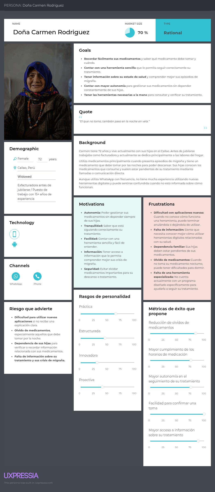

**Segmento 2: Familiares o cuidadores de adultos mayores**

  

### 2.3.2. User Task Matrix

#### Segmento 1: Adultos mayores

 <table> <thead> <tr> <th>Tarea</th> <th>Frecuencia</th> <th>Importancia</th> </tr> </thead> <tbody> <tr> <td>Recordar los medicamentos que debe tomar</td> <td>Often</td> <td>High</td> </tr> <tr> <td>Identificar cuándo debe tomar un medicamento</td> <td>Often</td> <td>High</td> </tr> <tr> <td>Tener sus medicamentos disponibles cuando los necesita</td> <td>Often</td> <td>High</td> </tr> <tr> <td>Tomar sus medicamentos durante una crisis de salud</td> <td>Sometimes</td> <td>High</td> </tr> <tr> <td>Tomar el medicamento indicado antes de dormir</td> <td>Often</td> <td>High</td> </tr> <tr> <td>Recordar si ya realizó una toma</td> <td>Sometimes</td> <td>High</td> </tr> <tr> <td>Consultar a sus familiares sobre aspectos relacionados con sus medicamentos</td> <td>Sometimes</td> <td>Medium</td> </tr> <tr> <td>Informar a sus familiares sobre su estado de salud</td> <td>Sometimes</td> <td>Medium</td> </tr> <tr> <td>Buscar información sobre sus problemas de salud</td> <td>Sometimes</td> <td>Medium</td> </tr> <tr> <td>Aprender a utilizar nuevas herramientas para el cuidado de su salud</td> <td>Rarely</td> <td>Medium</td> </tr> </tbody> </table> 

#### Segmento 2: Familiares o cuidadores de adultos mayores

 <table> <thead> <tr> <th>Tarea</th> <th>Frecuencia</th> <th>Importancia</th> </tr> </thead> <tbody> <tr> <td>Comunicarse con el adulto mayor para conocer su estado de salud</td> <td>Often</td> <td>High</td> </tr> <tr> <td>Preguntar al adulto mayor si tomó sus medicamentos</td> <td>Often</td> <td>High</td> </tr> <tr> <td>Recordar al adulto mayor que debe tomar sus medicamentos</td> <td>Often</td> <td>High</td> </tr> <tr> <td>Verificar que el adulto mayor haya tomado sus medicamentos</td> <td>Often</td> <td>High</td> </tr> <tr> <td>Realizar seguimiento del tratamiento del adulto mayor</td> <td>Often</td> <td>High</td> </tr> <tr> <td>Detectar cuando el adulto mayor olvida una toma</td> <td>Sometimes</td> <td>High</td> </tr> <tr> <td>Recordar periódicamente los horarios de medicación</td> <td>Often</td> <td>High</td> </tr> <tr> <td>Consultar directamente al adulto mayor cuando existe duda sobre una toma</td> <td>Sometimes</td> <td>Medium</td> </tr> <tr> <td>Dedicar tiempo diario al seguimiento de la medicación</td> <td>Often</td> <td>Medium</td> </tr> <tr> <td>Preocuparse por el cuidado general del adulto mayor cuando no está presente</td> <td>Often</td> <td>High</td> </tr> </tbody> </table> 

#### Análisis del User Task Matrix

Las tareas con mayor frecuencia e importancia para el segmento de adultos mayores están relacionadas con recordar y realizar correctamente sus tomas de medicamentos. Destacan recordar los medicamentos que debe tomar, identificar cuándo debe tomarlos, tenerlos disponibles y realizar las tomas correspondientes, principalmente calificadas como Often y High. La entrevista evidencia que el cumplimiento de la medicación puede estar relacionado con su bienestar, especialmente en situaciones como las crisis de migraña o la toma de medicamentos durante la noche. Asimismo, existe una necesidad de contar con herramientas sencillas que puedan ser comprendidas y utilizadas sin generar dificultades.

Para el segmento de familiares o cuidadores, las tareas de mayor frecuencia e importancia son preguntar si el adulto mayor tomó sus medicamentos, recordarle que debe tomarlos, verificar que la toma se haya realizado y realizar seguimiento del tratamiento. Estas tareas muestran que actualmente el familiar depende principalmente de la comunicación directa con el adulto mayor para conocer si cumplió con su medicación. Además, el entrevistado indicó que dedica aproximadamente 10 minutos diarios a realizar este tipo de seguimiento.

Una de las principales coincidencias entre ambos segmentos es que ambos participan en el cumplimiento y seguimiento de la medicación. El adulto mayor realiza las acciones relacionadas directamente con sus medicamentos, mientras que el familiar participa mediante recordatorios, preguntas y verificación. Por ello, una misma situación puede generar una tarea para ambos usuarios: mientras el adulto mayor necesita recordar y realizar una toma, el familiar necesita comprobar que esta se haya realizado.

La principal diferencia se encuentra en el rol que desempeña cada segmento dentro del proceso. El adulto mayor es quien ejecuta directamente la toma y necesita una forma sencilla de recordar sus medicamentos y horarios. En cambio, el familiar o cuidador cumple un rol de supervisión, dedicando tiempo a comunicarse con el adulto mayor y verificar que el tratamiento se esté siguiendo correctamente.

Finalmente, las tareas identificadas muestran que existe una necesidad de reducir la dependencia de la comunicación verbal para comprobar las tomas. Mientras que actualmente el familiar debe preguntar directamente al adulto mayor y confiar en su respuesta, el adulto mayor necesita una manera sencilla de indicar que ya realizó su toma. Esta relación entre ambos segmentos es fundamental para TATA, ya que permite plantear una solución que facilite el cumplimiento del tratamiento para el adulto mayor y, al mismo tiempo, reduzca la incertidumbre del familiar.

### 2.3.3. User Journey Mapping

#### Segmento 1: Adultos mayores

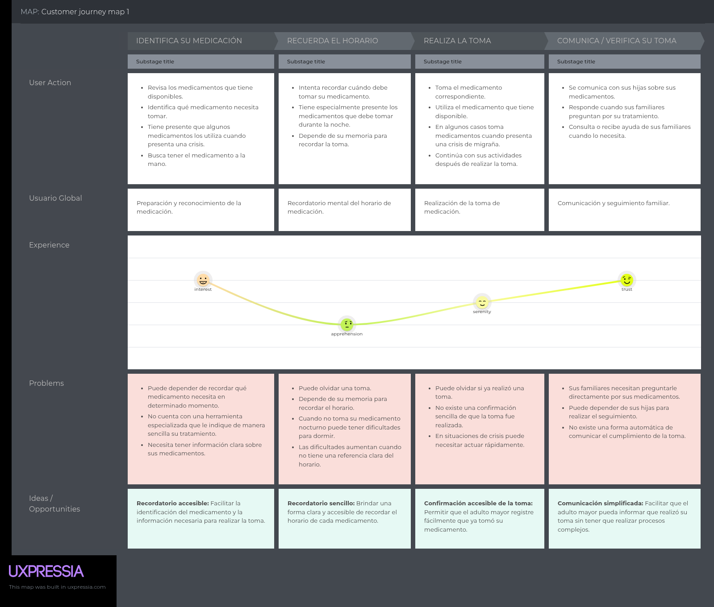

#### Segmento 2: Familiares o cuidadores de adultos mayores

### 2.3.4. Empathy Mapping

### 2.3.5. Big Picture EventStorming

El Big Picture EventStorming permitió representar de forma general cómo se desarrolla el dominio de Tata, desde el registro y la vinculación de los usuarios hasta el seguimiento de las tomas, la generación de alertas y el análisis de la adherencia. El modelo se construyó principalmente a partir de eventos de dominio expresados como hechos ya ocurridos y organizados según su secuencia dentro del negocio.

Para facilitar su lectura, el dominio se dividió en cuatro grupos principales: **Cuenta y cuidado**, **Tratamiento y toma**, **Omisión, seguimiento y analítica**, y **Continuidad y accesibilidad**. Los eventos principales se representaron mediante notas naranjas, mientras que las barras verticales identifican eventos pivote que marcan cambios relevantes dentro del flujo. También se incorporaron puntos problemáticos para mantener visibles situaciones que requieren mayor análisis o validación durante el desarrollo del proyecto.

*Figura. Big Picture EventStorming de Tata.*

#### Cuenta y cuidado

Este flujo representa la incorporación inicial de los usuarios al ecosistema de Tata y el establecimiento de la relación de cuidado. Comienza con la creación y verificación de la cuenta del familiar o cuidador, continúa con su habilitación y la activación del plan correspondiente.

Posteriormente, se registra el perfil del adulto mayor y se genera el mecanismo de vinculación entre ambas partes. El flujo culmina cuando se registra el consentimiento y se confirma el vínculo de cuidado. Este último evento resulta importante porque permite continuar con la configuración y seguimiento del tratamiento asociado al adulto mayor.

Los eventos pivote permiten distinguir momentos relevantes dentro del proceso, como la habilitación de la cuenta y la confirmación del vínculo. Asimismo, los puntos problemáticos asociados permiten mantener visibles aspectos que todavía pueden requerir validación, como la seguridad del proceso de vinculación y el consentimiento del adulto mayor.

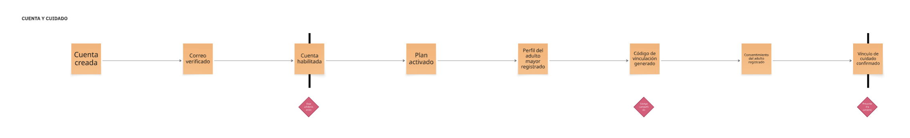

*Figura. Flujo de cuenta y cuidado.*

#### Tratamiento y toma

Este grupo describe el flujo principal relacionado con la configuración del tratamiento y la ejecución cotidiana de una toma. Inicialmente se registra el tratamiento, el medicamento, la dosis, el horario y los recordatorios necesarios. Cuando la configuración se encuentra completa, el tratamiento pasa a un estado activo y Tata puede calcular las próximas tomas programadas.

Al acercarse el horario establecido, se envía el recordatorio y se abre una ventana para que el adulto mayor registre la confirmación. A partir de este punto aparecen dos resultados principales. Si la toma es confirmada, se registra el evento correspondiente y se actualiza el historial diario. Si no existe confirmación dentro del periodo esperado, el flujo continúa hacia el proceso de gestión de omisiones.

La separación entre **Tratamiento activado** y los eventos correspondientes a una toma concreta permite distinguir la configuración general del tratamiento de su ejecución diaria. De igual forma, la bifurcación entre una toma confirmada y una toma no confirmada representa uno de los principales cambios de comportamiento dentro del dominio.

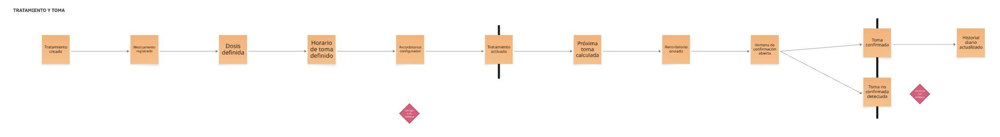

*Figura. Flujo de tratamiento y toma.*

#### Omisión, seguimiento y analítica

Este flujo representa lo que ocurre cuando una toma permanece sin confirmación y requiere atención adicional. Tata puede emitir un recordatorio reforzado y mantener abierta una ventana de tolerancia. Si el periodo definido finaliza sin una confirmación, la toma se registra como omitida y se genera una alerta dirigida al familiar o cuidador.

La alerta puede continuar mediante los canales configurados y, cuando corresponde, iniciar un proceso de escalamiento. Posteriormente, el familiar recibe información sobre la situación y puede realizar el seguimiento correspondiente. De esta forma, Tata no se limita a recordar una toma, sino que también permite informar al responsable del cuidado cuando se produce una situación relevante.

Los registros generados durante las tomas también alimentan el análisis de adherencia. Con el historial acumulado se pueden consolidar periodos de seguimiento, calcular indicadores e identificar patrones recurrentes, como horarios en los que aparecen retrasos u omisiones con mayor frecuencia. A partir de estos resultados, Tata puede mostrar recomendaciones orientadas a mejorar la continuidad del tratamiento.

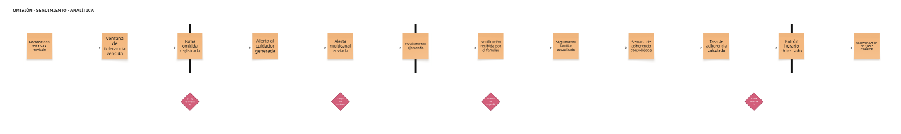

*Figura. Flujo de omisión, seguimiento y analítica.*

#### Continuidad y accesibilidad

Este último grupo reúne dos capacidades complementarias del dominio: la accesibilidad de la experiencia y la continuidad del tratamiento.

En cuanto a la accesibilidad, el usuario puede adaptar determinados aspectos de interacción de acuerdo con sus necesidades. Entre los eventos considerados se encuentran el ajuste del tamaño del texto, la habilitación de la confirmación por voz y el almacenamiento de las preferencias de accesibilidad. Estas configuraciones buscan reducir las barreras de interacción para adultos mayores con distintos niveles de familiaridad con dispositivos móviles.

Por otro lado, el flujo de continuidad considera el seguimiento de la disponibilidad de medicamentos. Tata puede recalcular el stock restante y detectar cuándo la cantidad disponible comienza a ser insuficiente. A partir de ello se puede emitir un recordatorio de reabastecimiento e iniciar el registro de la reposición. Una vez confirmada y registrado el nuevo lote, la agenda de tomas puede actualizarse para mantener la continuidad del tratamiento.

Aunque ambos flujos responden a necesidades diferentes, se incluyen dentro de esta vista general porque complementan el objetivo principal de Tata: facilitar una gestión de la medicación que pueda mantenerse en el tiempo y que resulte accesible para el adulto mayor.

*Figura. Flujos de continuidad y accesibilidad.*

En conjunto, el Big Picture EventStorming permitió identificar una secuencia global que parte de la incorporación y vinculación de los usuarios, continúa con la configuración y ejecución del tratamiento y se extiende hacia el manejo de omisiones, el seguimiento familiar, el análisis de la adherencia y la continuidad del tratamiento. Esta vista general sirve como base para profundizar posteriormente en los procesos del dominio mediante el EventStorming desarrollado en la sección de Strategic-Level Domain-Driven Design.

Enlace a la versión del Big Picture EventStorming: [https://miro.com/app/board/uXjVHq5Jc9w=/](https://miro.com/app/board/uXjVHq5Jc9w=/)

#### 2.3.6. Ubiquitous Language

El Ubiquitous Language se definió a partir de los conceptos identificados durante el análisis del dominio y el desarrollo del EventStorming. Su propósito es establecer un vocabulario común entre los integrantes del equipo y reducir interpretaciones diferentes sobre los elementos que forman parte de Tata.

Debido a que un mismo término puede adquirir un significado particular según el contexto en el que se utiliza, el vocabulario se organizó de acuerdo con los Bounded Contexts identificados. Esto permite mantener definiciones precisas dentro de cada parte del dominio y facilita la posterior especificación de reglas, eventos y relaciones.

##### Identidad y suscripción

| Término | Definición |
| --- | --- |
| Cuenta | Registro de acceso de un usuario en Tata. |
| Usuario | Persona autenticada que utiliza la aplicación. |
| Estado de cuenta | Condición que indica si la cuenta se encuentra habilitada. |
| Plan | Conjunto de funcionalidades asociado a una modalidad de uso. |
| Suscripción | Relación vigente entre una cuenta y un plan. |
| Consentimiento | Autorización registrada para el uso de datos y funcionalidades relacionadas con el cuidado. |
| Correo verificado | Correo cuya propiedad fue confirmada por el usuario. |

##### Vínculo de cuidado

| Término | Definición |
| --- | --- |
| Adulto mayor | Persona cuyo tratamiento es acompañado mediante Tata. |
| Familiar | Persona cercana que consulta y acompaña el seguimiento del adulto mayor. |
| Cuidador | Usuario autorizado para supervisar información relacionada con el adulto mayor. |
| Vínculo de cuidado | Relación autorizada entre un cuidador y un adulto mayor. |
| Código de vinculación | Código temporal utilizado para iniciar la asociación entre usuarios. |
| Consentimiento | Aceptación del adulto mayor para establecer la relación de cuidado. |
| Contacto de emergencia | Información de contacto disponible para situaciones que requieren mayor atención. |

##### Gestión del tratamiento

| Término | Definición |
| --- | --- |
| Tratamiento | Conjunto de reglas que define cómo debe administrarse un medicamento. |
| Medicamento | Producto asociado a una pauta de tratamiento. |
| Dosis | Cantidad indicada para una toma. |
| Frecuencia | Periodicidad con la que debe realizarse una toma. |
| Horario de toma | Hora programada para administrar una dosis. |
| Instrucciones | Indicaciones asociadas a la administración del medicamento. |
| Recordatorio | Aviso programado relacionado con una toma futura. |
| Tratamiento activo | Tratamiento completo y habilitado para generar tomas programadas. |

##### Ejecución de tomas

| Término | Definición |
| --- | --- |
| Toma | Instancia concreta de una dosis programada. |
| Próxima toma | Siguiente toma pendiente según la programación vigente. |
| Toma programada | Toma asociada a una fecha y hora determinadas. |
| Ventana de confirmación | Intervalo disponible para registrar la confirmación de una toma. |
| Confirmación | Registro realizado por el usuario para indicar que completó una toma. |
| Confirmación por voz | Confirmación registrada a partir de una frase reconocida por el sistema. |
| Confirmación por toque | Confirmación registrada mediante una interacción táctil. |
| Historial diario | Registro de las tomas y sus estados correspondientes a un día. |

##### Omisión y escalamiento

| Término | Definición |
| --- | --- |
| Toma no confirmada | Toma que no posee una confirmación dentro de la ventana inicial. |
| Tolerancia | Tiempo adicional disponible antes de considerar una omisión. |
| Pendiente | Estado temporal previo a determinar que una toma fue omitida. |
| Omisión | Toma que permanece sin confirmación después de finalizar el periodo permitido. |
| Alerta | Aviso generado para comunicar una situación que requiere atención del cuidador. |
| Escalamiento | Incremento del nivel de atención cuando una situación continúa sin respuesta. |
| Caso de omisión | Seguimiento de una omisión desde su detección hasta su cierre. |

##### Seguimiento familiar

| Término | Definición |
| --- | --- |
| Resumen familiar | Vista consolidada del estado reciente del adulto mayor. |
| Seguimiento | Conjunto de acciones realizadas por el familiar o cuidador para acompañar al adulto mayor. |
| Estado del adulto | Situación reciente obtenida a partir de las tomas, confirmaciones y alertas disponibles. |
| Alerta | Situación presentada al familiar porque requiere su atención. |
| Nota del cuidador | Registro textual asociado a una intervención o situación observada. |
| Contacto | Canal disponible para comunicarse con el adulto mayor. |
| Intervención | Acción realizada por el cuidador ante un estado, alerta o necesidad de seguimiento. |

##### Accesibilidad y preferencias

| Término | Definición |
| --- | --- |
| Tamaño de texto | Escala visual aplicada a los textos de la aplicación. |
| Contraste | Nivel de diferenciación visual aplicado a los elementos de la interfaz. |
| Reducción de movimiento | Preferencia que disminuye animaciones y transiciones de la aplicación. |
| Confirmación por voz | Preferencia que habilita el uso de la voz como mecanismo de confirmación de una toma. |
| Ayuda de lectura | Soporte destinado a facilitar la comprensión del contenido presentado. |
| Horario de silencio | Intervalo en el que se restringen determinadas notificaciones no críticas. |
| Canal de notificación | Medio habilitado para recibir avisos. |
| Preferencias | Conjunto de configuraciones asociadas a la experiencia de un usuario. |

##### Analítica de adherencia

| Término | Definición |
| --- | --- |
| Adherencia | Grado de cumplimiento del tratamiento durante un periodo determinado. |
| Tasa de adherencia | Porcentaje de tomas cumplidas respecto de las tomas esperadas durante un periodo. |
| Toma tardía | Toma confirmada después de su horario previsto, pero dentro del periodo considerado válido. |
| Omisión | Toma que no fue confirmada dentro del periodo establecido. |
| Patrón horario | Tendencia recurrente asociada a determinadas franjas de tiempo. |
| Riesgo de omisión | Estimación de la posibilidad de que se produzcan futuras omisiones. |
| Insight | Hallazgo obtenido a partir del análisis del historial de adherencia. |
| Recomendación | Consejo orientativo generado a partir de los resultados del análisis. |

##### Inventario y reposición

| Término | Definición |
| --- | --- |
| Inventario | Cantidad disponible de un medicamento. |
| Stock restante | Número de unidades disponibles en un momento determinado. |
| Stock bajo | Estado alcanzado cuando las unidades disponibles llegan al umbral establecido. |
| Umbral de reposición | Cantidad mínima que provoca la generación de un aviso de reabastecimiento. |
| Lote | Conjunto de unidades incorporadas al inventario durante una reposición. |
| Solicitud de reposición | Registro de la necesidad de reabastecer un medicamento. |
| Continuidad | Condición en la que el tratamiento puede mantenerse sin interrupciones por falta de medicamento. |
| Reabastecimiento | Incremento del stock disponible después de una reposición. |

Algunos términos aparecen en más de un contexto, como **Consentimiento**, **Confirmación por voz**, **Omisión** y **Alerta**. Esta repetición responde a que su significado depende de la responsabilidad del contexto. Por ejemplo, una omisión representa el estado de una toma no confirmada dentro de **Omisión y escalamiento**, mientras que en **Analítica de adherencia** se utiliza como un dato histórico para calcular indicadores y detectar patrones. Mantener estas diferencias permite utilizar el mismo vocabulario de manera consistente sin mezclar responsabilidades entre los modelos del dominio.

## 2.4. Requirements specification

Durante la etapa de investigación, el equipo pudo confirmar algo que ya se intuía desde el planteamiento inicial del proyecto: muchos adultos mayores tienen dificultades para llevar un control constante de su medicación, y sus familiares, al no vivir con ellos o no tener cómo verificarlo, terminan preocupados sin una forma real de saber si todo está bien. A partir de esos hallazgos, en esta sección se definen los requisitos de **Tata**, buscando que cada funcionalidad responda a una necesidad concreta detectada en las entrevistas y no simplemente a una idea aislada del equipo.
 
Para ordenar este trabajo, la sección se divide en cuatro partes:
 
- **To-Be Scenario Mapping**, donde se compara cómo se vive hoy el problema (As-Is) frente a cómo debería sentirse la experiencia una vez que la app esté funcionando (To-Be).
- **User Stories**, con las funcionalidades descritas desde la perspectiva de cada usuario, tanto el adulto mayor como el familiar que lo acompaña.
- **Impact Map**, que conecta el objetivo del negocio con los actores y los cambios de comportamiento que se busca lograr en ellos.
- **Product Backlog**, donde finalmente se ordenan y priorizan las historias de usuario e historias técnicas que se van a desarrollar.

### 2.4.1. User Stories

A partir de los requisitos identificados en la investigación, el equipo tradujo cada necesidad detectada en historias de usuario, agrupadas en epics según el módulo al que pertenecen. Además de las historias orientadas al adulto mayor y al familiar, se incluyen historias técnicas para aquellas funcionalidades que no tienen una interacción directa con el usuario final (como los endpoints del backend), y dos spike stories para investigar la viabilidad de los componentes que requieren aprendizaje autónomo antes de comenzar su implementación.

Cada historia de usuario sigue el formato Story ID / User / Priority / Epic, con su Title, Description y Acceptance Criteria redactados bajo la estructura Given-When-Then, en tiempo presente y tercera persona, evitando hacer referencia a elementos específicos de interfaz.

**Epics identificadas**

| Epic ID | Nombre | Descripción breve |
|---|---|---|
| EPIC-01 | Autenticación y Vinculación de Cuentas | Acceso simplificado del adulto mayor y vinculación con la cuenta del familiar |
| EPIC-02 | Gestión de Medicamentos | Registro, edición y eliminación de medicamentos por parte del familiar |
| EPIC-03 | Confirmación de Toma de Medicamento | Recordatorio y confirmación de la toma desde la app del adulto mayor |
| EPIC-04 | Monitoreo y Notificaciones | Visibilidad del familiar sobre el estado de las tomas y la adherencia |
| EPIC-05 | Detección de Patrones de Olvido (IA) | Análisis de historial para anticipar olvidos recurrentes |
 
---

**User Stories**

<table>
<tr><th>Story ID</th><th>User</th><th>Priority</th><th>Epic</th></tr>
<tr><td>US-01</td><td>Adulto mayor</td><td>Alta</td><td>EPIC-01</td></tr>
<tr><td colspan="4"><strong>Title:</strong> Ingreso simplificado a la aplicación</td></tr>
<tr><td colspan="4"><strong>Description</strong> Como adulto mayor, quiero ingresar a la aplicación con un PIN corto y sencillo, para no tener que recordar contraseñas complicadas.</td></tr>
<tr><td colspan="4"><strong>Acceptance Criteria</strong> 
1. Dado que el adulto mayor abre la aplicación por primera vez, cuando ingresa un PIN de cuatro dígitos, entonces el sistema registra dicho PIN como su credencial de acceso. 
2. Dado que el adulto mayor ya tiene un PIN registrado, cuando lo ingresa correctamente, entonces el sistema le da acceso a la pantalla principal. 
3. Dado que el adulto mayor ingresa un PIN incorrecto, cuando lo intenta tres veces seguidas, entonces el sistema bloquea temporalmente el acceso y sugiere contactar a su familiar.
</td></tr>
</table>
<table>
<tr><th>Story ID</th><th>User</th><th>Priority</th><th>Epic</th></tr>
<tr><td>US-02</td><td>Familiar</td><td>Alta</td><td>EPIC-01</td></tr>
<tr><td colspan="4"><strong>Title:</strong> Vinculación con la cuenta del adulto mayor</td></tr>
<tr><td colspan="4"><strong>Description</strong> Como familiar, quiero vincular mi cuenta con la de mi adulto mayor mediante un código, para poder monitorear su tratamiento desde mi propia aplicación.</td></tr>
<tr><td colspan="4"><strong>Acceptance Criteria</strong> 
1. Dado que el adulto mayor tiene una cuenta creada, cuando el sistema genera un código de vinculación para esa cuenta, entonces dicho código queda disponible para ser compartido. 
2. Dado que el familiar cuenta con el código de vinculación, cuando lo ingresa en su aplicación, entonces el sistema asocia ambas cuentas. 
3. Dado que dos familiares distintos ingresan el mismo código de vinculación, cuando ambos lo registran, entonces el sistema permite que ambos queden vinculados al mismo adulto mayor.
</td></tr>
</table>
<table>
<tr><th>Story ID</th><th>User</th><th>Priority</th><th>Epic</th></tr>
<tr><td>US-03</td><td>Familiar</td><td>Alta</td><td>EPIC-02</td></tr>
<tr><td colspan="4"><strong>Title:</strong> Registro de un nuevo medicamento</td></tr>
<tr><td colspan="4"><strong>Description</strong> Como familiar, quiero registrar un medicamento con su dosis, horario y días de la semana, para que el sistema le recuerde a mi adulto mayor cuándo debe tomarlo.</td></tr>
<tr><td colspan="4"><strong>Acceptance Criteria</strong> 
1. Dado que el familiar completa el nombre, la dosis y al menos un horario del medicamento, cuando confirma el registro, entonces el sistema guarda el medicamento como activo para el adulto mayor vinculado. 
2. Dado que el familiar no completa el nombre del medicamento, cuando intenta confirmar el registro, entonces el sistema rechaza la operación y no crea el medicamento. 
3. Dado que un medicamento fue registrado con éxito, cuando llega la fecha y hora programada, entonces el sistema genera una toma pendiente asociada a ese medicamento.
</td></tr>
</table>
<table>
<tr><th>Story ID</th><th>User</th><th>Priority</th><th>Epic</th></tr>
<tr><td>US-04</td><td>Familiar</td><td>Media</td><td>EPIC-02</td></tr>
<tr><td colspan="4"><strong>Title:</strong> Edición y eliminación de un medicamento</td></tr>
<tr><td colspan="4"><strong>Description</strong> Como familiar, quiero editar o eliminar un medicamento ya registrado, para mantener actualizado el tratamiento cuando cambie una indicación médica.</td></tr>
<tr><td colspan="4"><strong>Acceptance Criteria</strong> 
1. Dado que existe un medicamento registrado, cuando el familiar modifica su horario o dosis, entonces el sistema actualiza la información y aplica el cambio a las próximas tomas programadas. 
2. Dado que existe un medicamento registrado, cuando el familiar lo elimina, entonces el sistema deja de generar nuevas tomas para dicho medicamento, conservando el historial previo.
</td></tr>
</table>
<table>
<tr><th>Story ID</th><th>User</th><th>Priority</th><th>Epic</th></tr>
<tr><td>US-05</td><td>Adulto mayor</td><td>Alta</td><td>EPIC-03</td></tr>
<tr><td colspan="4"><strong>Title:</strong> Recordatorio de toma de medicamento</td></tr>
<tr><td colspan="4"><strong>Description</strong> Como adulto mayor, quiero recibir un recordatorio a la hora indicada de mi medicamento, para no olvidarme de tomarlo.</td></tr>
<tr><td colspan="4"><strong>Acceptance Criteria</strong> 
1. Dado que existe una toma programada para la hora actual, cuando dicha hora se cumple, entonces el sistema envía un recordatorio al adulto mayor. 
2. Dado que un recordatorio fue enviado, cuando el adulto mayor no confirma la toma dentro del tiempo de tolerancia configurado, entonces el sistema envía un segundo recordatorio.
</td></tr>
</table>
<table>
<tr><th>Story ID</th><th>User</th><th>Priority</th><th>Epic</th></tr>
<tr><td>US-06</td><td>Adulto mayor</td><td>Alta</td><td>EPIC-03</td></tr>
<tr><td colspan="4"><strong>Title:</strong> Confirmación de toma por voz o por selección</td></tr>
<tr><td colspan="4"><strong>Description</strong> Como adulto mayor, quiero confirmar que tomé mi medicamento con una sola acción, ya sea hablando o seleccionando una opción, para no tener que escribir nada.</td></tr>
<tr><td colspan="4"><strong>Acceptance Criteria</strong> 
1. Dado que existe una toma pendiente, cuando el adulto mayor confirma la toma mediante voz, entonces el sistema reconoce la confirmación y cambia el estado de la toma a confirmada. 
2. Dado que existe una toma pendiente, cuando el adulto mayor selecciona la confirmación sin usar voz, entonces el sistema cambia el estado de la toma a confirmada. 
3. Dado que una toma ya fue confirmada, cuando el adulto mayor intenta confirmarla nuevamente, entonces el sistema no genera un registro duplicado.
</td></tr>
</table>
<table>
<tr><th>Story ID</th><th>User</th><th>Priority</th><th>Epic</th></tr>
<tr><td>US-07</td><td>Familiar</td><td>Alta</td><td>EPIC-04</td></tr>
<tr><td colspan="4"><strong>Title:</strong> Notificación del estado de una toma</td></tr>
<tr><td colspan="4"><strong>Description</strong> Como familiar, quiero recibir una notificación cuando una toma es confirmada o queda sin confirmar, para estar al tanto sin necesidad de llamar constantemente.</td></tr>
<tr><td colspan="4"><strong>Acceptance Criteria</strong> 
1. Dado que el adulto mayor confirma una toma, cuando el sistema registra dicha confirmación, entonces envía una notificación al familiar vinculado. 
2. Dado que una toma supera el tiempo de tolerancia sin ser confirmada, cuando el sistema la marca como omitida, entonces envía una notificación al familiar vinculado.
</td></tr>
</table>
<table>
<tr><th>Story ID</th><th>User</th><th>Priority</th><th>Epic</th></tr>
<tr><td>US-08</td><td>Familiar</td><td>Media</td><td>EPIC-04</td></tr>
<tr><td colspan="4"><strong>Title:</strong> Resumen de adherencia al tratamiento</td></tr>
<tr><td colspan="4"><strong>Description</strong> Como familiar, quiero ver un resumen del cumplimiento de los medicamentos durante la semana, para entender cómo ha ido el tratamiento en general.</td></tr>
<tr><td colspan="4"><strong>Acceptance Criteria</strong> 
1. Dado que existen tomas registradas durante los últimos siete días, cuando el familiar consulta el resumen semanal, entonces el sistema muestra el porcentaje de tomas confirmadas frente al total programado. 
2. Dado que no existen tomas registradas en el periodo consultado, cuando el familiar accede al resumen, entonces el sistema indica que no hay información disponible para ese periodo.
</td></tr>
</table>
<table>
<tr><th>Story ID</th><th>User</th><th>Priority</th><th>Epic</th></tr>
<tr><td>US-09</td><td>Familiar</td><td>Media</td><td>EPIC-05</td></tr>
<tr><td colspan="4"><strong>Title:</strong> Alerta de patrón de olvido recurrente</td></tr>
<tr><td colspan="4"><strong>Description</strong> Como familiar, quiero recibir una alerta cuando el sistema detecta que una toma se olvida de forma repetida en un horario específico, para poder ajustar el tratamiento junto al médico o modificar el recordatorio.</td></tr>
<tr><td colspan="4"><strong>Acceptance Criteria</strong> 
1. Dado que un medicamento acumula tres o más tomas omitidas en el mismo horario dentro de las últimas cuatro semanas, cuando el sistema evalúa el historial, entonces genera una alerta de patrón para el familiar. 
2. Dado que una alerta de patrón fue generada, cuando el familiar la revisa, entonces el sistema le permite acceder directamente a la edición del medicamento asociado.
</td></tr>
</table>

---

**Technical Stories**

<table>
<tr><th>Story ID</th><th>User</th><th>Priority</th><th>Epic</th></tr>
<tr><td>TS-01</td><td>Developer</td><td>Alta</td><td>EPIC-01</td></tr>
<tr><td colspan="4"><strong>Title:</strong> Endpoint de autenticación por PIN</td></tr>
<tr><td colspan="4"><strong>Description</strong> Como developer, quiero implementar el endpoint que valida el PIN del adulto mayor, para que la aplicación pueda autenticar sus solicitudes.</td></tr>
<tr><td colspan="4"><strong>Acceptance Criteria</strong> 
1. Dado un request con un PIN válido registrado, cuando se envía al endpoint de autenticación, entonces el response devuelve un token de sesión con código 200. 
2. Dado un request con un PIN inválido, cuando se envía al endpoint de autenticación, entonces el response devuelve un código 401 sin generar token.
</td></tr>
</table>
<table>
<tr><th>Story ID</th><th>User</th><th>Priority</th><th>Epic</th></tr>
<tr><td>TS-02</td><td>Developer</td><td>Alta</td><td>EPIC-01</td></tr>
<tr><td colspan="4"><strong>Title:</strong> Endpoint de vinculación familiar-paciente</td></tr>
<tr><td colspan="4"><strong>Description</strong> Como developer, quiero implementar el endpoint que asocia la cuenta de un familiar con la de un adulto mayor mediante un código, para reflejar esa relación en el sistema.</td></tr>
<tr><td colspan="4"><strong>Acceptance Criteria</strong> 
1. Dado un request con un código de vinculación existente y vigente, cuando se envía al endpoint de vinculación, entonces el response crea la relación familiar-paciente y devuelve código 201. 
2. Dado un request con un código de vinculación expirado o inexistente, cuando se envía al endpoint de vinculación, entonces el response devuelve código 404 sin crear ninguna relación.
</td></tr>
</table>
<table>
<tr><th>Story ID</th><th>User</th><th>Priority</th><th>Epic</th></tr>
<tr><td>TS-03</td><td>Developer</td><td>Alta</td><td>EPIC-02</td></tr>
<tr><td colspan="4"><strong>Title:</strong> Endpoints CRUD de medicamentos</td></tr>
<tr><td colspan="4"><strong>Description</strong> Como developer, quiero exponer los endpoints para crear, actualizar, eliminar y listar medicamentos, para que la aplicación del familiar pueda gestionar el tratamiento del adulto mayor.</td></tr>
<tr><td colspan="4"><strong>Acceptance Criteria</strong> 
1. Dado un request con los datos obligatorios de un medicamento, cuando se envía al endpoint de creación, entonces el response registra el medicamento y devuelve código 201. 
2. Dado un request de actualización sobre un medicamento existente, cuando se envía al endpoint correspondiente, entonces el response refleja los cambios y devuelve código 200. 
3. Dado un request de eliminación sobre un medicamento existente, cuando se envía al endpoint correspondiente, entonces el response marca el medicamento como inactivo y devuelve código 200.
</td></tr>
</table>
<table>
<tr><th>Story ID</th><th>User</th><th>Priority</th><th>Epic</th></tr>
<tr><td>TS-04</td><td>Developer</td><td>Alta</td><td>EPIC-03</td></tr>
<tr><td colspan="4"><strong>Title:</strong> Endpoint de confirmación de toma</td></tr>
<tr><td colspan="4"><strong>Description</strong> Como developer, quiero implementar el endpoint que registra la confirmación de una toma, para actualizar su estado en la base de datos.</td></tr>
<tr><td colspan="4"><strong>Acceptance Criteria</strong> 
1. Dado un request de confirmación sobre una toma en estado pendiente, cuando se envía al endpoint correspondiente, entonces el response cambia el estado a confirmada y devuelve código 200. 
2. Dado un request de confirmación sobre una toma ya confirmada previamente, cuando se envía al endpoint correspondiente, entonces el response devuelve código 409 sin duplicar el registro.
</td></tr>
</table>
<table>
<tr><th>Story ID</th><th>User</th><th>Priority</th><th>Epic</th></tr>
<tr><td>TS-05</td><td>Developer</td><td>Media</td><td>EPIC-04</td></tr>
<tr><td colspan="4"><strong>Title:</strong> Proceso automático de tomas vencidas</td></tr>
<tr><td colspan="4"><strong>Description</strong> Como developer, quiero implementar un proceso que revise periódicamente las tomas pendientes vencidas, para marcarlas como omitidas y disparar la notificación correspondiente.</td></tr>
<tr><td colspan="4"><strong>Acceptance Criteria</strong> 
1. Dado que una toma pendiente supera el tiempo de tolerancia configurado, cuando el proceso automático se ejecuta, entonces cambia el estado de la toma a omitida. 
2. Dado que una toma fue marcada como omitida, cuando el proceso automático finaliza, entonces se genera una solicitud de notificación hacia el servicio de mensajería.
</td></tr>
</table>
<table>
<tr><th>Story ID</th><th>User</th><th>Priority</th><th>Epic</th></tr>
<tr><td>TS-06</td><td>Developer</td><td>Media</td><td>EPIC-04</td></tr>
<tr><td colspan="4"><strong>Title:</strong> Endpoint de envío de notificaciones push</td></tr>
<tr><td colspan="4"><strong>Description</strong> Como developer, quiero exponer el endpoint que dispara una notificación push al familiar, para informarle sobre el estado de una toma.</td></tr>
<tr><td colspan="4"><strong>Acceptance Criteria</strong> 
1. Dado un request con el identificador de una toma y el familiar destinatario, cuando se envía al endpoint de notificaciones, entonces el response confirma el envío y devuelve código 200. 
2. Dado un request con un familiar destinatario sin dispositivo registrado, cuando se envía al endpoint de notificaciones, entonces el response devuelve código 404 sin intentar el envío.
</td></tr>
</table>

---

**Spike Stories**

***Spike 1: Investigar la Integración de Reconocimiento de Voz (Speech-to-Text) para la Confirmación de Tomas***
 
**Contexto**
La aplicación del adulto mayor requiere una forma de confirmar la toma de medicamentos sin depender exclusivamente de la lectura o escritura, dado que parte del público objetivo tiene dificultad para interactuar con interfaces convencionales. El equipo evalúa incorporar un SDK de reconocimiento de voz (por ejemplo, el Speech Recognition nativo de Android/iOS, o un servicio externo como Google Speech-to-Text) dentro de la aplicación móvil, considerando que este componente no ha sido trabajado previamente en el curso.
 
**Spike Story**
Como equipo de desarrollo, quiero investigar y prototipar la integración de un servicio de reconocimiento de voz en la aplicación del adulto mayor, para entender su precisión, facilidad de integración y esfuerzo necesario antes de implementarlo como funcionalidad definitiva.
 
**Criterios de Aceptación**
 
1. Dado que el equipo necesita conocer las opciones disponibles, cuando revisa la documentación de al menos dos alternativas de reconocimiento de voz (SDK nativo vs. servicio externo), entonces documenta ventajas, limitaciones y costos de cada una en un informe.
2. Dado que se eligió una alternativa preliminar, cuando el equipo construye un prototipo mínimo que reconoce la frase "ya tomé mi pastilla" en español, entonces el prototipo queda registrado en una rama del repositorio.
3. Dado que el prototipo está construido, cuando se realizan pruebas con distintas formas de pronunciar la frase, entonces el equipo documenta el porcentaje de reconocimiento correcto obtenido.
4. Dado que las pruebas fueron realizadas, cuando el equipo evalúa los resultados, entonces documenta una recomendación final sobre si la alternativa evaluada es viable para el proyecto.
**Definition of Done (DoD)**
- El código del prototipo está registrado en una rama del repositorio.
- El informe con hallazgos, precisión obtenida y recomendación final es compartido con el equipo.
- Los hallazgos se utilizan para crear o ajustar la historia de usuario US-06 en el backlog.
- El spike está limitado a 8 horas y se completa dentro del sprint correspondiente.

---
 
***Spike 2: Investigar un Modelo Simple de Detección de Patrones de Olvido***
 
**Contexto**
Como parte del feature de aprendizaje autónomo del proyecto, el equipo busca incorporar un mecanismo que analice el historial de tomas y detecte patrones recurrentes de olvido (por ejemplo, un horario donde el adulto mayor suele omitir la toma con frecuencia). Este análisis no corresponde a un tema cubierto directamente en el curso, por lo que se requiere investigar una aproximación simple antes de integrarla al backend.
 
**Spike Story**
Como equipo de desarrollo, quiero investigar y prototipar una forma simple de detectar patrones de olvido a partir del historial de tomas, para determinar qué enfoque (reglas estadísticas o un modelo de clasificación básico) es viable de implementar dentro del alcance del proyecto.
 
**Criterios de Aceptación**
 
1. Dado que el equipo necesita comparar alternativas, cuando investiga un enfoque basado en reglas estadísticas simples y un enfoque basado en un modelo de clasificación básico (por ejemplo, con una librería ligera de machine learning), entonces documenta las diferencias, complejidad de implementación y precisión esperada de cada uno.
2. Dado que se seleccionó un enfoque preliminar, cuando el equipo construye un prototipo que procesa un set de datos de prueba con tomas confirmadas y omitidas, entonces el prototipo identifica al menos un patrón esperado dentro de los datos de prueba.
3. Dado que el prototipo genera resultados, cuando el equipo revisa la salida obtenida, entonces documenta si el resultado es lo suficientemente claro como para mostrarse directamente al familiar.
**Definition of Done (DoD)**
- El código del prototipo está registrado en una rama del repositorio.
- El informe con el enfoque recomendado y sus limitaciones es compartido con el equipo.
- Los hallazgos se utilizan para crear o ajustar la historia de usuario US-09 en el backlog.
- El spike está limitado a 8 horas y se completa dentro del sprint correspondiente.

### 2.4.2. Impact Mapping

### 2.4.3. Product Backlog

### 2.5. Strategic-Level Domain-Driven Design

El Strategic-Level Domain-Driven Design se utilizó para organizar el dominio de Tata a partir de las responsabilidades, reglas y conceptos identificados durante las etapas anteriores del proyecto. El objetivo de esta etapa no es definir todavía componentes físicos de software, sino establecer límites conceptuales que permitan mantener modelos coherentes y reducir el acoplamiento entre distintas áreas del dominio.

Para ello, se profundizó el EventStorming desarrollado previamente, incorporando actores, comandos, políticas, modelos de lectura, sistemas externos y agregados. A partir de estos elementos se identificaron candidatos a Bounded Context, se analizaron los mensajes relevantes que atraviesan sus límites y se documentó la responsabilidad interna de cada contexto mediante Bounded Context Canvases.

Este análisis permite pasar de una representación general del comportamiento de Tata hacia una estructura estratégica del dominio que posteriormente servirá como base para el Context Mapping y las decisiones de arquitectura de software.

### 2.5.1. EventStorming

El EventStorming se utilizó para profundizar los procesos identificados previamente en el Big Picture EventStorming. Mientras el Big Picture permitió observar de forma global qué ocurre dentro del dominio de Tata, esta etapa incorporó mayor detalle sobre las acciones que originan los eventos, las reglas que reaccionan ante ellos y los conceptos responsables de mantener el estado y las reglas del negocio.

El modelado se desarrolló de manera progresiva. Inicialmente se organizaron los eventos de dominio según su secuencia temporal y se identificaron puntos problemáticos y eventos pivote. Posteriormente se incorporaron comandos y actores para representar qué acciones originan cada cambio dentro del dominio.

A medida que el modelo fue refinado, se añadieron políticas para representar comportamientos automáticos, modelos de lectura para identificar la información requerida antes de ejecutar determinadas acciones y sistemas externos que participan en los distintos procesos. Finalmente, los comandos y eventos relacionados se organizaron alrededor de agregados, lo que permitió comenzar a reconocer responsabilidades y límites conceptuales dentro del dominio.

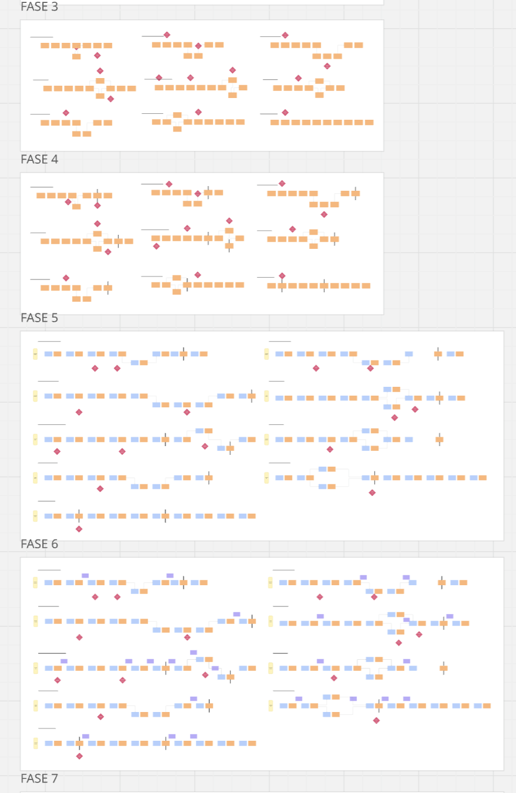

*Figura. EventStorming del dominio de Tata.*

Enlace a la versión del EventStorming: [https://miro.com/app/board/uXjVHq5Jc9w=/](https://miro.com/app/board/uXjVHq5Jc9w=/)

#### Evolución del EventStorming

La construcción progresiva del EventStorming permitió aumentar el nivel de detalle sin perder la secuencia principal del dominio. Los primeros pasos estuvieron orientados a comprender el comportamiento y sus principales problemas, mientras que las etapas posteriores incorporaron los elementos necesarios para analizar las reglas y responsabilidades involucradas.

*Figura. Evolución del EventStorming de Tata Pain Points.*

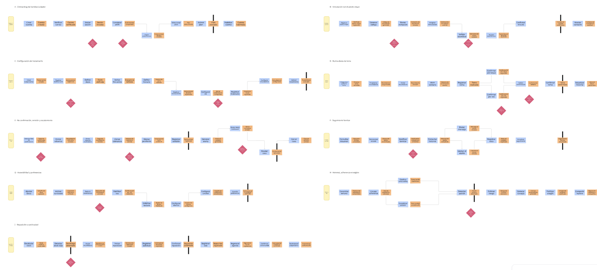

*Figura. Evolución del EventStorming de Tata Commands.*

*Figura. Evolución del EventStorming de Tata Aggregates.*

#### 2.5.1.1. Candidate Context Discovery

A partir del EventStorming refinado se analizaron grupos de eventos, comandos, políticas y agregados que compartían un mismo lenguaje y conjunto de responsabilidades. El propósito fue identificar áreas del dominio que requieren mantener un modelo propio y cuyos conceptos pueden evolucionar de forma relativamente independiente.

La agrupación no se realizó únicamente por proximidad dentro del tablero. Se consideraron principalmente las responsabilidades asumidas por cada conjunto de elementos, las reglas que gobiernan su comportamiento y los cambios de significado que aparecen al pasar de un proceso a otro.

Por ejemplo, **Gestión del tratamiento** administra la definición del medicamento, dosis, frecuencia y horario, mientras que **Ejecución de tomas** administra cada instancia concreta generada a partir de esa configuración. Aunque ambos contextos trabajan con información relacionada, responden a preguntas diferentes dentro del dominio y poseen ciclos de vida distintos.

*Figura. Descubrimiento de candidatos a Bounded Context.*

Enlace a la version de Eventstorming Bounded Context: [https://miro.com/app/board/uXjVHq5Jc9w=/](https://miro.com/app/board/uXjVHq5Jc9w=/)

Como resultado se identificaron los siguientes candidatos:

| Candidate Context | Responsabilidad principal |
| --- | --- |
| Identidad y suscripción | Gestionar la existencia, acceso y habilitación de los usuarios |
| Vínculo de cuidado | Administrar la relación autorizada entre familiar y adulto mayor |
| Gestión del tratamiento | Definir medicamentos, dosis, horarios e instrucciones |
| Ejecución de tomas | Gestionar cada toma programada y su confirmación |
| Omisión y escalamiento | Administrar tomas no confirmadas, alertas y escalamiento |
| Seguimiento familiar | Presentar información y registrar las intervenciones del cuidador |
| Accesibilidad y preferencias | Adaptar la interacción y las preferencias del usuario |
| Analítica de adherencia | Calcular indicadores, patrones e insights de adherencia |
| Inventario y reposición | Mantener la disponibilidad y continuidad de los medicamentos |

Estos límites se consideran candidatos dentro de esta etapa y no implican que cada contexto deba implementarse posteriormente como un microservicio independiente.

#### 2.5.1.2. Domain Message Flows Modeling

El Domain Message Flows Modeling se utilizó para representar las interacciones que ocurren entre los actores, Bounded Contexts y sistemas externos que participan en los principales procesos de Tata. A diferencia del EventStorming, donde se estudia el comportamiento interno del dominio mediante eventos, comandos y políticas, en esta etapa el interés se centra en los mensajes que atraviesan los límites previamente identificados.

El modelado se desarrolló a partir de escenarios concretos del dominio. Cada escenario representa una situación relevante de uso y muestra la secuencia de mensajes intercambiados entre sus participantes. Los mensajes se clasificaron como **Commands**, cuando solicitan la ejecución de una acción; **Events**, cuando comunican un hecho que ya ocurrió; y **Queries**, cuando un participante requiere información para continuar con una decisión o proceso.

Para mantener los diagramas legibles, cada escenario fue modelado de manera independiente. Las relaciones representan dependencias conceptuales del dominio y no establecen todavía el mecanismo técnico mediante el cual se implementará la comunicación.

##### Registro y vinculación del adulto mayor

Este escenario representa el proceso mediante el cual un familiar o cuidador ingresa a Tata y establece una relación de cuidado con un adulto mayor. El flujo comienza con la creación y verificación de la cuenta, continúa con el registro del adulto mayor y finaliza cuando la vinculación es aceptada y confirmada.

En este proceso participan principalmente **Identidad y suscripción** y **Vínculo de cuidado**. El primero administra el estado de la cuenta, mientras que el segundo mantiene la relación autorizada entre ambos usuarios. El servicio de correo interviene como sistema externo durante la verificación de la cuenta.

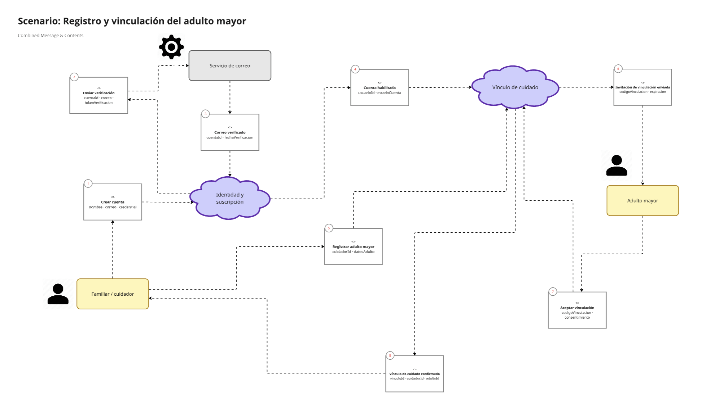

*Figura. Domain Message Flow para el registro y vinculación del adulto mayor.*

##### Configuración y activación del tratamiento

Este escenario describe la configuración inicial de un tratamiento asociado al adulto mayor. El familiar registra el medicamento y define los datos necesarios para su administración, como la dosis, frecuencia, horario e instrucciones de toma.

Antes de realizar determinadas operaciones, **Gestión del tratamiento** puede consultar a **Vínculo de cuidado** para verificar que el familiar se encuentre autorizado para administrar la información del adulto mayor. Una vez completa la configuración, la activación del tratamiento genera información necesaria para que **Ejecución de tomas** pueda comenzar a programar las tomas correspondientes.

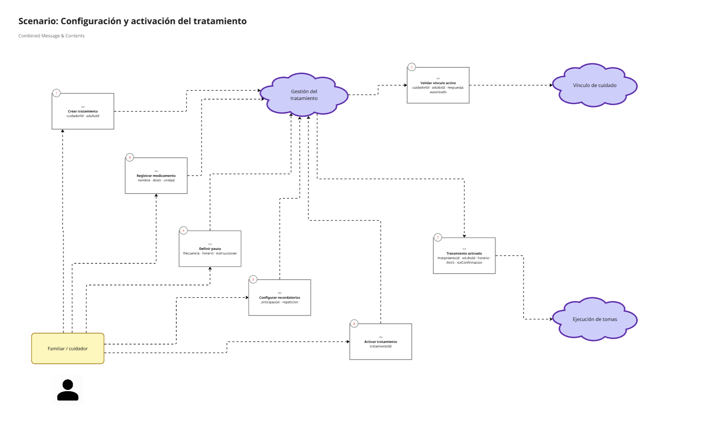

*Figura. Domain Message Flow para la configuración y activación del tratamiento.*

##### Confirmación de una toma mediante un toque

Este escenario representa el camino esperado cuando el adulto mayor recibe un recordatorio y confirma correctamente una toma mediante interacción táctil.

El adulto puede consultar la próxima toma programada y posteriormente registrar su confirmación. Una vez aceptada, **Ejecución de tomas** comunica el resultado a otros contextos interesados. **Analítica de adherencia** utiliza el evento para actualizar las métricas del adulto, mientras que **Seguimiento familiar** puede utilizarlo para actualizar el estado mostrado al familiar o cuidador.

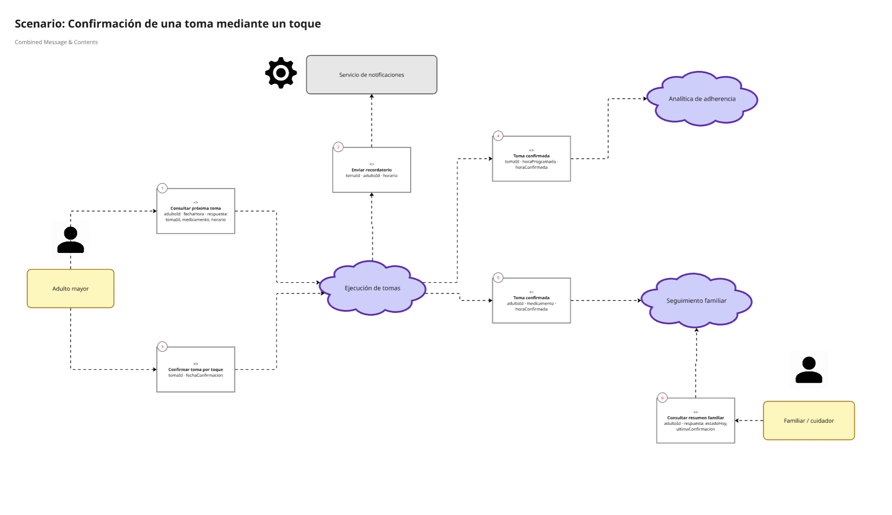

*Figura. Domain Message Flow para la confirmación de una toma mediante un toque.*

##### Confirmación de una toma mediante voz

Este escenario representa la alternativa accesible mediante la cual el adulto mayor puede registrar la confirmación utilizando su voz. En este flujo, **Ejecución de tomas** coordina la interacción con un servicio externo de reconocimiento de voz para procesar el audio recibido.

Si la transcripción puede ser validada, se registra la confirmación y se generan los mismos eventos de dominio empleados por el flujo táctil. De esta manera, el método utilizado para interactuar puede variar sin modificar el significado principal del evento **Toma confirmada** para los demás contextos.

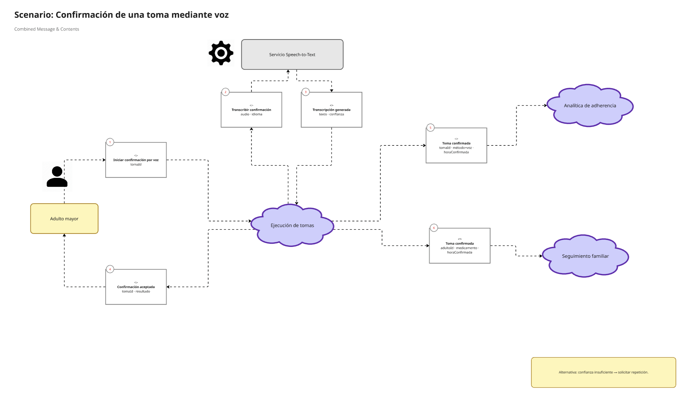

*Figura. Domain Message Flow para la confirmación de una toma mediante voz.*

##### Toma no confirmada, omisión y escalamiento

Este escenario representa el flujo alternativo que se inicia cuando el adulto mayor no confirma una toma dentro del periodo esperado.

Al finalizar la ventana inicial, **Ejecución de tomas** comunica la ausencia de confirmación a **Omisión y escalamiento**. Este contexto administra los recordatorios reforzados y la ventana de tolerancia. Si el tiempo establecido concluye sin una respuesta, se registra la omisión y se genera una alerta.

La omisión también es comunicada a **Analítica de adherencia**, mientras que **Seguimiento familiar** recibe la información necesaria para advertir al familiar o cuidador. Los servicios externos de notificación permiten posteriormente entregar la alerta mediante los canales habilitados.

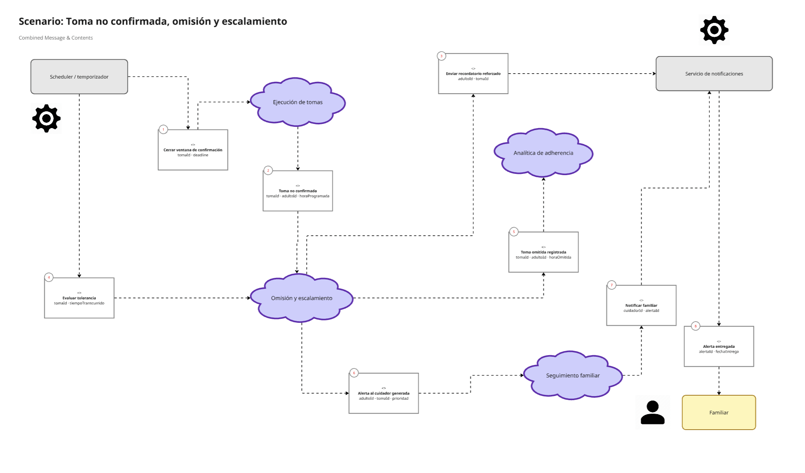

*Figura. Domain Message Flow para una toma no confirmada, omisión y escalamiento.*

##### Seguimiento familiar ante una alerta

Este escenario describe las acciones disponibles para el familiar después de recibir información sobre una situación que requiere atención. El familiar puede consultar el resumen del adulto mayor, revisar las tomas recientes y acceder a los indicadores de adherencia disponibles.

**Seguimiento familiar** reúne información proporcionada por otros contextos sin asumir sus responsabilidades internas. Cuando el familiar necesita intervenir, puede registrar una nota, iniciar una llamada o utilizar otro canal disponible para comunicarse con el adulto mayor.

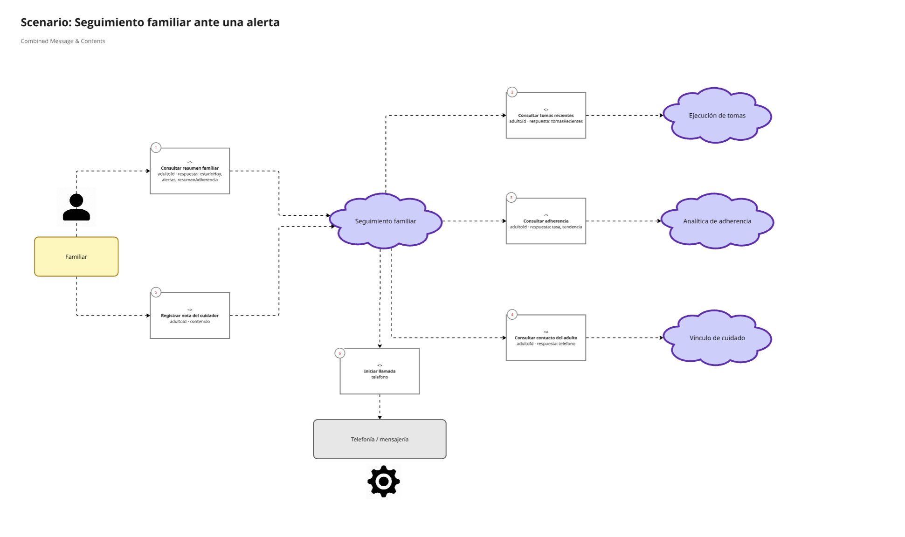

*Figura. Domain Message Flow para el seguimiento familiar ante una alerta.*

##### Consolidación de adherencia y detección de patrones

Este escenario representa el procesamiento de los resultados acumulados durante la ejecución de las tomas. **Analítica de adherencia** recibe información acerca de las tomas confirmadas, tardías u omitidas y la utiliza para consolidar periodos de seguimiento.

A partir de estos registros se calculan indicadores de adherencia y se pueden identificar patrones recurrentes relacionados con determinados horarios o periodos. Los resultados relevantes son publicados para que **Seguimiento familiar** pueda mostrarlos posteriormente al cuidador sin tener que reproducir internamente la lógica analítica.

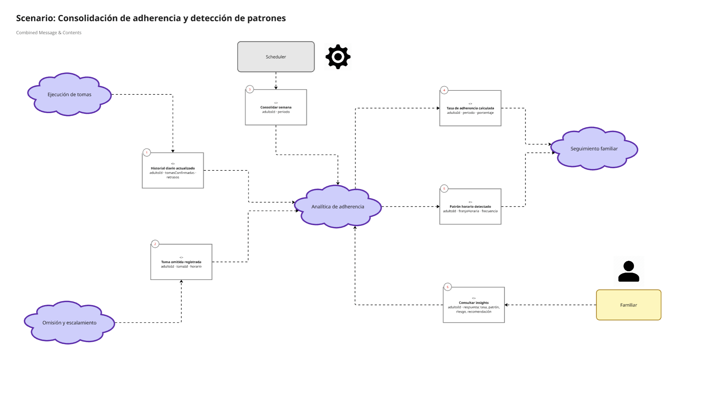

*Figura. Domain Message Flow para la consolidación de adherencia y detección de patrones.*

##### Reposición y continuidad del tratamiento

Este escenario representa el seguimiento del stock disponible de un medicamento y las acciones relacionadas con su reposición. **Inventario y reposición** permite consultar las unidades restantes y detectar situaciones en las que el medicamento puede agotarse antes de las próximas tomas.

Cuando se alcanza el umbral definido, se puede generar un aviso al familiar. Después de registrar una reposición o un nuevo lote, el contexto comunica los cambios necesarios para mantener actualizada la planificación de futuras tomas y conservar la continuidad del tratamiento.

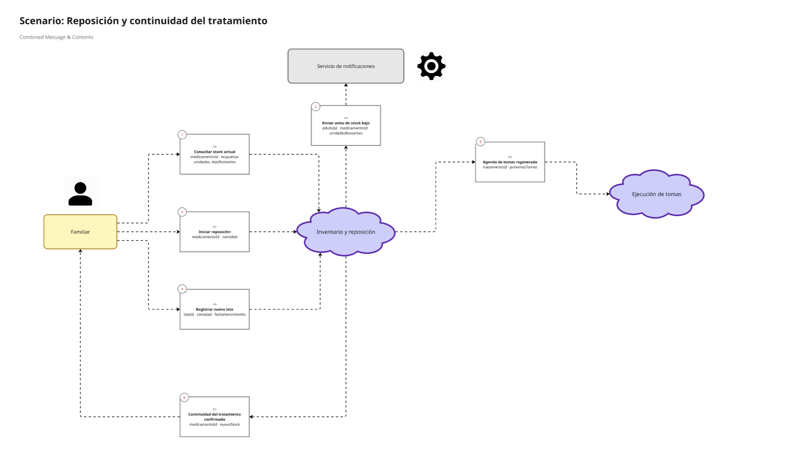

*Figura. Domain Message Flow para la reposición y continuidad del tratamiento.*

En conjunto, los escenarios permitieron identificar los principales intercambios de información entre los límites del dominio de Tata. El modelado muestra que los Bounded Contexts colaboran mediante mensajes específicos sin compartir directamente sus reglas internas. Este resultado también sirve como entrada para documentar con mayor precisión las responsabilidades, mensajes y dependencias de cada contexto mediante los Bounded Context Canvases.

Enlace a la version del Domain Message Flow: [https://miro.com/app/board/uXjVHq5Jc9w=/](https://miro.com/app/board/uXjVHq5Jc9w=/)

#### 2.5.1.3. Bounded Context Canvases

Los Bounded Context Canvases se utilizaron para documentar individualmente los contextos identificados durante el Candidate Context Discovery. Mientras el EventStorming permitió reconocer los posibles límites y el Domain Message Flows Modeling mostró las interacciones entre ellos, los canvases permitieron precisar el propósito y las responsabilidades que corresponden a cada contexto.

Cada canvas documenta su descripción, clasificación estratégica, características del modelo, decisiones de negocio y términos principales del Ubiquitous Language. Asimismo, se especifican los Commands, Events y Queries que el contexto consume o produce, además de sus principales proveedores y consumidores de información.

Esta representación permitió revisar que cada contexto mantuviera responsabilidades coherentes y que las colaboraciones necesarias pudieran realizarse mediante mensajes explícitos, evitando que diferentes áreas del dominio dependieran de los detalles internos de otras.

##### Identidad y suscripción

El Bounded Context **Identidad y suscripción** concentra las responsabilidades relacionadas con la existencia y habilitación de una cuenta dentro de Tata. Incluye la creación del usuario, la verificación de su información básica y el estado del plan asociado.

Sus reglas determinan cuándo una cuenta puede considerarse habilitada y qué información puede ser utilizada posteriormente por otros contextos. Entre los conceptos principales de su lenguaje se encuentran **Cuenta**, **Usuario**, **Plan**, **Suscripción**, **Consentimiento** y **Estado de cuenta**.

Una de sus principales salidas es el evento **Cuenta habilitada**, que permite que el contexto de Vínculo de cuidado continúe con el registro de la relación entre el familiar y el adulto mayor.

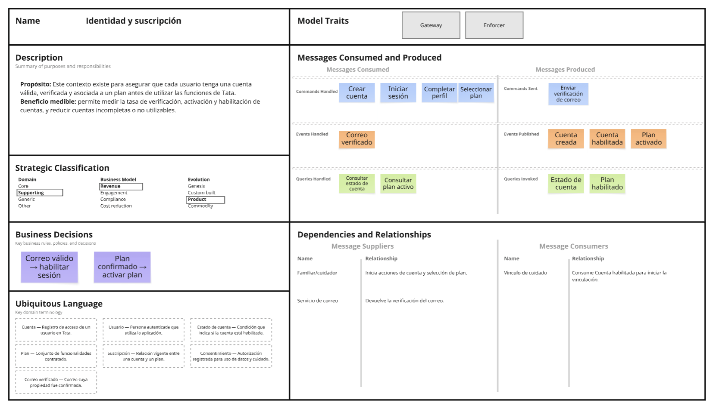

*Figura. Bounded Context Canvas de Identidad y suscripción.*

##### Vínculo de cuidado

El contexto **Vínculo de cuidado** administra la relación autorizada entre el adulto mayor y el familiar o cuidador encargado de su seguimiento.

Su modelo mantiene información relacionada con el adulto mayor, los códigos de vinculación, el consentimiento y el estado de la relación. Entre sus principales decisiones se encuentra validar que una cuenta pueda iniciar una vinculación y que el consentimiento requerido haya sido registrado antes de habilitar el seguimiento.

El evento **Vínculo de cuidado confirmado** representa uno de sus resultados más importantes, ya que permite que otros contextos reconozcan que el familiar posee una relación válida con el adulto mayor.

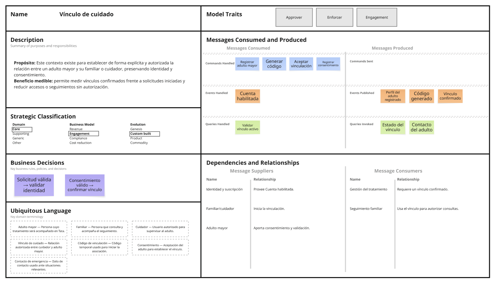

*Figura. Bounded Context Canvas de Vínculo de cuidado.*

##### Gestión del tratamiento

El contexto **Gestión del tratamiento** mantiene la definición operativa del tratamiento del adulto mayor. Dentro de este límite se gestionan el medicamento, la dosis, frecuencia, horario, instrucciones y configuración de recordatorios.

Su responsabilidad termina en definir **qué tratamiento debe seguirse**. No administra cada ejecución concreta de una dosis, ya que esa responsabilidad pertenece a Ejecución de tomas.

Cuando la configuración requerida se encuentra completa, el contexto puede publicar el evento **Tratamiento activado**, que proporciona la información necesaria para generar las futuras tomas.

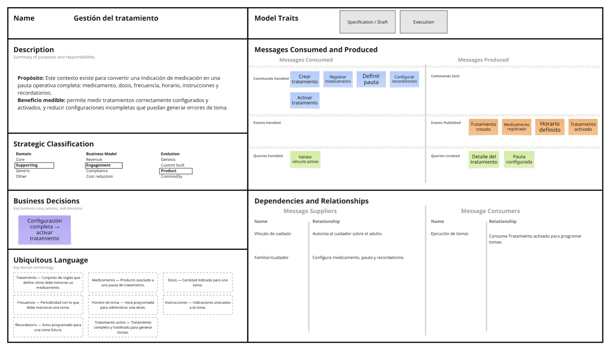

*Figura. Bounded Context Canvas de Gestión del tratamiento.*

##### Ejecución de tomas

El contexto **Ejecución de tomas** administra las instancias concretas generadas a partir de un tratamiento activo. Su responsabilidad comienza cuando debe programarse una toma y continúa hasta que esta queda confirmada o se detecta que permanece sin confirmación.

Dentro de este contexto se manejan conceptos como **Toma**, **Próxima toma**, **Ventana de confirmación**, **Confirmación por toque** y **Confirmación por voz**.

También coordina servicios externos necesarios para determinadas interacciones, como el reconocimiento de voz o las notificaciones. Sus principales eventos de salida incluyen **Toma confirmada**, **Toma no confirmada** e **Historial diario actualizado**.

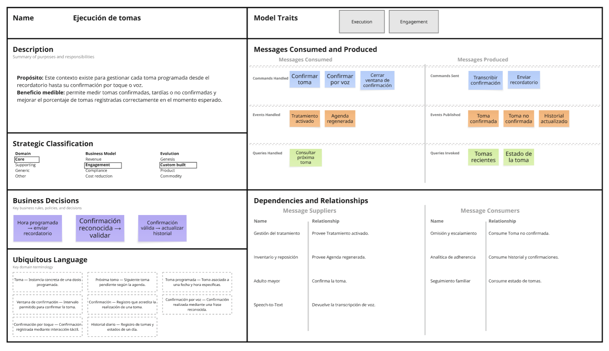

*Figura. Bounded Context Canvas de Ejecución de tomas.*

##### Omisión y escalamiento

El contexto **Omisión y escalamiento** administra las situaciones excepcionales originadas cuando una toma permanece sin confirmación.

Este contexto controla la ventana de tolerancia, los recordatorios reforzados, el registro de una omisión, la generación de alertas y el escalamiento cuando corresponde. De esta manera, la lógica de excepción no queda mezclada con la ejecución normal de una toma.

Entre sus eventos principales se encuentran **Toma omitida registrada**, **Alerta al cuidador generada** y **Escalamiento ejecutado**. Estos eventos pueden ser consumidos posteriormente por Analítica de adherencia y Seguimiento familiar.

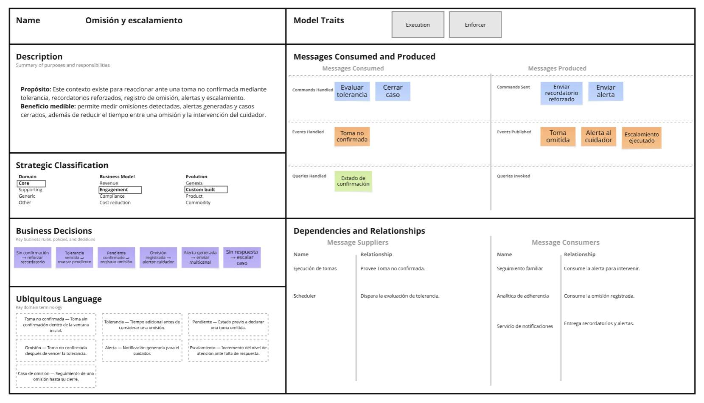

*Figura. Bounded Context Canvas de Omisión y escalamiento.*

##### Seguimiento familiar

El contexto **Seguimiento familiar** representa la visión del dominio orientada al familiar o cuidador. Su responsabilidad es reunir y presentar la información necesaria para conocer el estado reciente del adulto mayor y facilitar una intervención cuando sea necesaria.

Este contexto recibe información producida por Ejecución de tomas, Omisión y escalamiento y Analítica de adherencia. A partir de ella permite construir un resumen familiar, consultar información relevante y registrar acciones como notas del cuidador.

El contexto no recalcula la adherencia ni decide cuándo una toma se convierte en una omisión; consume los resultados generados por los contextos responsables de esas reglas.

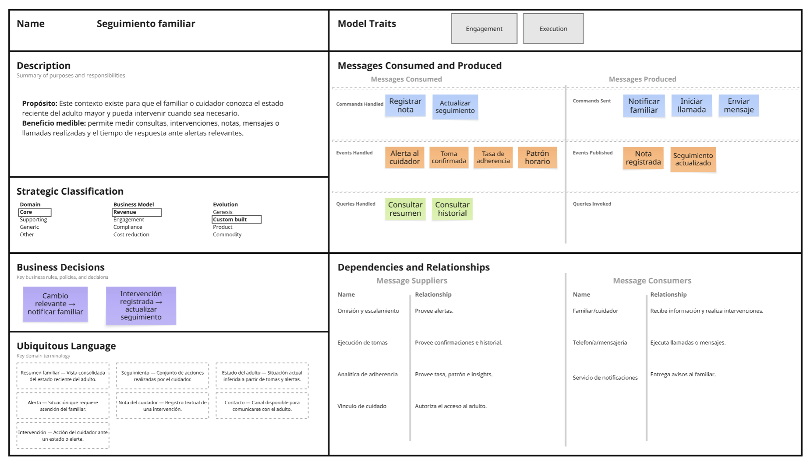

*Figura. Bounded Context Canvas de Seguimiento familiar.*

##### Accesibilidad y preferencias

El contexto **Accesibilidad y preferencias** administra las configuraciones que permiten adaptar la interacción con Tata según las necesidades de cada usuario.

Incluye elementos como el tamaño de texto, contraste reforzado, reducción de movimiento, confirmación por voz, ayuda de lectura, horario de silencio y canales de notificación.

Estas preferencias poseen un carácter transversal debido a que pueden condicionar el comportamiento de otras áreas del producto. Sin embargo, mantenerlas dentro de un modelo propio evita que cada contexto deba definir nuevamente las reglas relacionadas con la configuración personal del usuario.

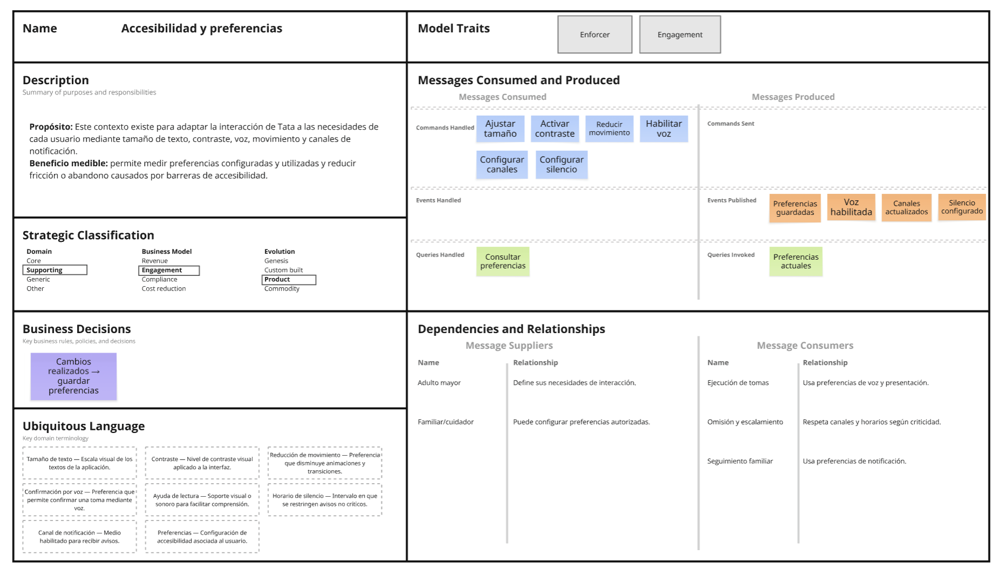

*Figura. Bounded Context Canvas de Accesibilidad y preferencias.*

##### Analítica de adherencia

El contexto **Analítica de adherencia** transforma los resultados acumulados de las tomas en información útil para comprender la evolución del tratamiento.

Su modelo maneja conceptos como **Adherencia**, **Tasa de adherencia**, **Toma tardía**, **Omisión**, **Patrón horario**, **Riesgo de omisión**, **Insight** y **Recomendación**.

El contexto recibe los registros generados durante la ejecución normal y los casos de omisión. A partir de ellos puede consolidar periodos, calcular indicadores e identificar patrones. Los resultados obtenidos se publican posteriormente para que otros contextos, especialmente Seguimiento familiar, puedan utilizarlos.

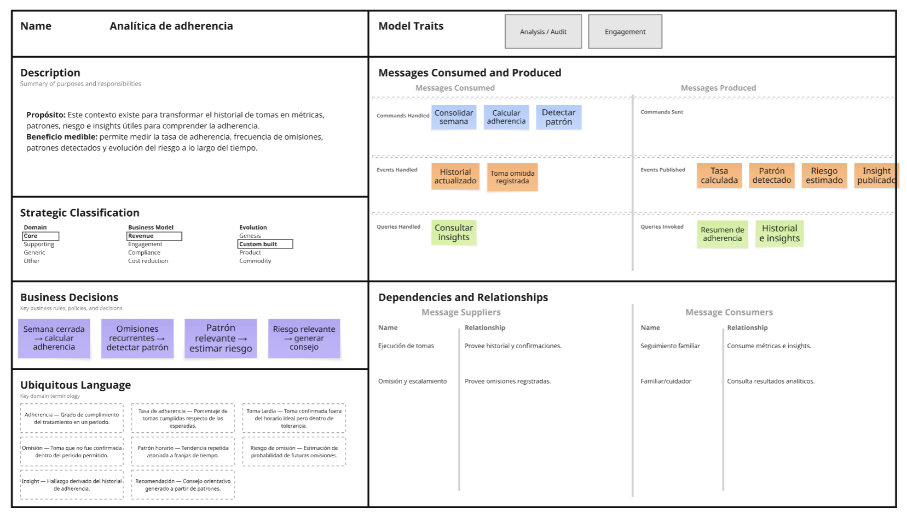

*Figura. Bounded Context Canvas de Analítica de adherencia.*

##### Inventario y reposición

El contexto **Inventario y reposición** administra la disponibilidad de los medicamentos asociados a un tratamiento y las acciones necesarias para mantener su continuidad.

Su modelo contempla el stock disponible, el umbral de reposición, los lotes registrados y el proceso de reabastecimiento. Cuando detecta que las unidades restantes se acercan a un límite establecido, puede generar un aviso para el familiar.

Después de registrar una reposición, el contexto puede producir información que permita actualizar la planificación de futuras tomas. De esta manera, la disponibilidad física del medicamento se mantiene separada de las reglas propias de la configuración del tratamiento y de la ejecución diaria.

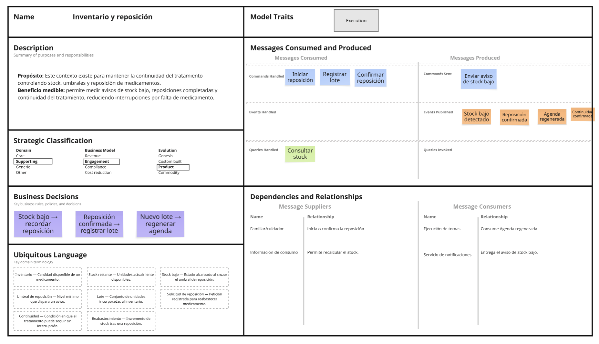

*Figura. Bounded Context Canvas de Inventario y reposición.*

En conjunto, los nueve Bounded Context Canvases permitieron precisar las responsabilidades y colaboraciones identificadas durante el EventStorming. El resultado proporciona una visión más estable de los límites estratégicos del dominio y sirve como base para el posterior Context Mapping, donde se analizarán las relaciones existentes entre estos contextos y la forma en que sus modelos deben colaborar.

Enlace a la version de Bounded Context Canvas: [https://miro.com/app/board/uXjVHq5Jc9w=/](https://miro.com/app/board/uXjVHq5Jc9w=/)

### 2.5.2. Context Mapping

### 2.5.3. Software Architecture

#### 2.5.3.1. Software Architecture Context Level Diagrams

#### 2.5.3.2. Software Architecture Container Level Diagrams

#### 2.5.3.3. Software Architecture Deployment Diagrams

## 2.6. Tactical-Level Domain-Driven Design

### 2.6.x. Bounded Context: <Bounded Context Name>

#### 2.6.x.1. Domain Layer

#### 2.6.x.2. Interface Layer

#### 2.6.x.3. Application Layer

#### 2.6.x.4 Infrastructure Layer

#### 2.6.x.5. Bounded Context Software Architecture Component Level Diagrams

#### 2.6.x.6. Bounded Context Software Architecture Code Level Diagrams

##### 2.6.x.6.1. Bounded Context Domain Layer Class Diagrams

##### 2.6.x.6.2. Bounded Context Database Design Diagram
