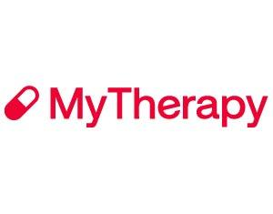

# Capítulo II: Requirements Development and Software Solution Design
## 2.1. Competidores

Para el análisis competitivo de Tata se identificaron tres soluciones digitales relacionadas con el cuidado remoto y la adherencia al tratamiento médico de personas mayores. Se consideraron competidores directos cuyo nucleo del producto sea el recordatorio de medicación con alertas al cuidador, así como un competidor indirecto orientado a la coordinación familiar del cuidado en general.

**Competidor 1: Medisafe**  
Aplicación de recordatorio de medicamentos con más de 10 millones de usuarios a nivel global. Permite programar dosis, registrar la toma y, mediante su función "Medfriend", notificar a un familiar cuando una dosis fue omitida. Cuenta con un plan gratuito limitado y un plan premium mensual/anual con reportes de adherencia ilimitados.

**Competidor 2: MyTherapy**  
Aplicación gratuita desarrollada por la empresa alemana smartpatient GmbH, orientada a recordatorios de medicación y diario de salud (síntomas, mediciones). No requiere suscripción de pago y opera bajo estándares de privacidad GDPR, pero su función de monitoreo remoto para un familiar es limitada frente a soluciones especializadas en cuidado a distancia.

**Competidor 3: Caring Village**  
Plataforma de coordinación de cuidado familiar que integra listas de tareas, calendario compartido, almacenamiento de documentos y recordatorios de medicación básicos dentro de un "círculo de cuidado" con múltiples cuidadores. Su enfoque es más amplio que la sola adherencia a medicamentos, por lo que no está optimizada para la simplicidad de uso que requiere un adulto mayor con baja alfabetización digital.

### 2.1.1. Análisis competitivo

<table>
  <tr>
    <th colspan="2" style="background-color: #f6f8fa; text-align: left;">¿Por qué llevar a cabo este análisis?</th>
    <td colspan="4">Se busca contrastar la propuesta de valor de Tata frente a soluciones existentes de recordatorio de medicación y coordinación de cuidado, identificando vacíos que Tata puede cubrir, particularmente en la combinación de accesibilidad para el adulto mayor y anticipación de olvidos mediante detección de patrones.</td>
  </tr>

  <tr align="center">
    <th width="12%">Perfil / Criterio</th>
    <th width="18%">Subcriterio</th>
    <th width="17.5%">
       
      <b>Tata (VitaHealth)</b>
    </th>
    <th width="17.5%">
       
      <b>Medisafe</b>
    </th>
    <th width="17.5%">
       
      <b>MyTherapy</b>
    </th>
    <th width="17.5%">
       
      <b>Caring Village</b>
    </th>
  </tr>

  <tr>
    <td colspan="2"><b>Overview — Perfil</b></td>
    <td>Aplicación móvil enfocada en la adherencia a medicamentos para adultos mayores con baja alfabetización digital, mediante confirmación por voz o un solo toque, y un panel de monitoreo en tiempo real para la familia.</td>
    <td>Aplicación de recordatorio de medicación con función de alerta al cuidador (Medfriend) ante dosis omitidas.</td>
    <td>Aplicación gratuita de recordatorio de medicación y diario de salud, sin foco específico en cuidadores remotos.</td>
    <td>Plataforma de coordinación del cuidado familiar con múltiples cuidadores, calendario y tareas compartidas.</td>
  </tr>

  <tr>
    <td colspan="2"><b>Ventaja competitiva / ¿Qué valor ofrece a los clientes?</b></td>
    <td>Interfaz ultra simplificada (voz/un toque) diseñada para adultos mayores + anticipación de olvidos mediante detección de patrones.</td>
    <td>Amplia base de usuarios y robusta base de datos sobre interacciones entre medicamentos.</td>
    <td>Gratuita sin límites, enfoque integral en salud (no solo enfocado en medicación).</td>
    <td>Coordinación entre varios cuidadores familiares, no solo un contacto de alerta.</td>
  </tr>

  <tr>
    <td rowspan="2" align="center" style="vertical-align: middle;"><b>Perfil de Marketing</b></td>
    <td><b>Mercado objetivo</b></td>
    <td>Familias limeñas con adultos mayores de 68-85 años que viven solos o con poca compañía.</td>
    <td>Usuarios individuales a nivel global con tratamientos crónicos, con opción de compartir información con un familiar.</td>
    <td>Personas que gestionan su propia medicación y buscan una alternativa gratuita.</td>
    <td>Familias con múltiples cuidadores que coordinan el cuidado integral de un adulto mayor.</td>
  </tr>
  <tr>
    <td><b>Estrategias de marketing</b></td>
    <td>Cercanía local, alianzas estratégicas con clínicas, farmacias y aseguradoras (canal B2B2C).</td>
    <td>Marketing digital masivo y posicionamiento orgánico/pagado en app stores globales.</td>
    <td>Posicionamiento por gratuidad y cumplimiento estricto de privacidad (GDPR).</td>
    <td>Posicionamiento en comunidades de cuidadores familiares (blogs, guías de soporte).</td>
  </tr>

  <tr>
    <td rowspan="3" align="center" style="vertical-align: middle;"><b>Perfil de Producto</b></td>
    <td><b>Productos & Servicios</b></td>
    <td>Aplicación móvil (adulto mayor + familiar) + reconocimiento de voz + detección de patrones de olvido.</td>
    <td>Aplicación móvil de recordatorios + seguimiento de interacciones + reportes de adherencia.</td>
    <td>Aplicación móvil de recordatorios + diario de salud + sincronización con Apple Health / Google Fit.</td>
    <td>Aplicación móvil de coordinación de cuidado + recordatorios básicos + almacenamiento de documentos.</td>
  </tr>
  <tr>
    <td><b>Precios & Costos</b></td>
    <td>Modelo freemium con suscripción mensual para el familiar (plan premium).</td>
    <td>Gratuito (limitado a 2 medicamentos) / Premium a USD 4.99 mensual o USD 39.99 anual.</td>
    <td>Gratis, sin muro de pago.</td>
    <td>Gratis.</td>
  </tr>
  <tr>
    <td><b>Canales de distribución (Web y/o Móvil)</b></td>
    <td>Aplicación móvil nativa (Android/iOS) + Sitio web (Landing Page).</td>
    <td>Aplicación móvil (iOS/Android).</td>
    <td>Aplicación móvil (iOS/Android).</td>
    <td>Aplicación móvil (iOS/Android) + versión web.</td>
  </tr>
  
  <tr>
    <td rowspan="4" align="center" style="vertical-align: middle;"><b>Análisis SWOT</b></td>
    <td><b>Fortalezas</b></td>
    <td>Interfaz diseñada específicamente para baja alfabetización digital (voz/un toque); detección de patrones de olvido como diferenciador único.</td>
    <td>Base de usuarios masiva (+10M) y robustez en el seguimiento de interacciones medicamentosas.</td>
    <td>Gratuidad total sin muro de pago; buen posicionamiento en privacidad de datos (cumplimiento GDPR).</td>
    <td>Coordinación entre múltiples cuidadores familiares, no solo un contacto único de alerta.</td>
  </tr>
  <tr>
    <td><b>Debilidades</b></td>
    <td>Startup nueva sin base de usuarios ni reconocimiento de marca; recursos limitados frente a aplicaciones consolidadas.</td>
    <td>Interfaz no optimizada para adultos mayores con baja alfabetización digital; versión gratuita limitada a 2 medicamentos.</td>
    <td>Monitoreo remoto para el familiar limitado; sin función de anticipación de olvidos.</td>
    <td>Enfoque generalista que diluye la especialización en medicación; no diseñada para uso autónomo del adulto mayor.</td>
  </tr>
  <tr>
    <td><b>Oportunidades</b></td>
    <td>Mercado peruano de salud digital para adultos mayores poco atendido; alianzas B2B2C con clínicas y aseguradoras.</td>
    <td>Expansión a mercados latinoamericanos no explotados.</td>
    <td>Ampliar funciones dirigidas al cuidador a futuro.</td>
    <td>Integrar funciones más específicas de salud y seguimiento clínico.</td>
  </tr>
  <tr>
    <td><b>Amenazas</b></td>
    <td>Aplicaciones globales gratuitas que reducen la disposición a pagar; posible entrada de competidores locales con mayor respaldo.</td>
    <td>Soluciones locales más simples y económicas orientadas específicamente al segmento de adultos mayores.</td>
    <td>Al ser gratuita, presiona a Tata a justificar claramente el valor monetario de su modelo freemium.</td>
    <td>Aplicaciones especializadas como Tata, con foco exclusivo en medicación, pueden captar al segmento que busca esa profundidad.</td>
  </tr>
</table>

### 2.1.2. Estrategias y tácticas frente a competidores

Para posicionar a **Tata** de manera sólida frente a las alternativas del mercado, se establecen estrategias específicas según el perfil de cada competidor, complementadas con una táctica transversal de adquisición local:

* **Frente a Medisafe (Diferenciación por accesibilidad extrema):** Mientras Medisafe se enfoca en el seguimiento clínico avanzado y un alto volumen de usuarios, Tata centrará su propuesta en eliminar barreras de uso. Se aplicará un testeo continuo de la interfaz de confirmación por voz y un solo toque con adultos mayores reales del segmento objetivo, evitando la sobrecarga de funciones que dificulta la adopción autónoma en plataformas complejas.

* **Frente a MyTherapy (Posicionamiento por valor agregado vs. gratuidad):** Ante la ventaja de gratuidad total de MyTherapy, Tata no competirá por precio, sino por el valor diferencial de la detección de patrones de olvido y el panel de monitoreo familiar en tiempo real. Esta propuesta se comunicará claramente en la Landing Page y la app para justificar el modelo *freemium*.

* **Frente a Caring Village (Especialización exclusiva):** Dado que Caring Village se orienta a la coordinación general del cuidado (calendario, tareas y documentos), Tata mantendrá su foco exclusivo en la adherencia a medicamentos. Esta táctica evita la dispersión funcional y atiende de forma directa el problema central identificado en la investigación.

* **Táctica transversal de adquisición (Canal B2B2C local):** Se establecerán alianzas estratégicas con clínicas geriátricas y farmacias en Lima Metropolitana para acelerar la captura de usuarios a través de un canal local que ninguno de los tres competidores internacionales aprovecha actualmente.

## 2.2. Entrevistas

### 2.2.1. Diseño de entrevistas

Para cada segmento objetivo se diseñó una guía de entrevista semiestructurada. Esta se compone de preguntas principales que abordan directamente los objetivos de la investigación y preguntas complementarias que permiten profundizar según las respuestas del entrevistado.

El diseño busca recolectar información de ambos segmentos sobre:
* **Datos demográficos y contexto:** Género, edad, distrito de residencia, estado civil, composición familiar y ocupación.
* **Perfil cualitativo:** Personalidad, habilidades, afinidad por marcas, influencias y dispositivos preferidos.
* **Comportamiento digital:** Canales digitales de interacción y uso de asistentes o comandos de voz.
* **Dominio del problema:** Objetivos, frustraciones y antecedentes o biografía relevante vinculada a la adherencia a la medicación y el cuidado remoto.

---

#### Guía de entrevista — Segmento Adulto Mayor

**Preguntas demográficas y de contexto**  
**1.** ¿Podría contarme un poco sobre usted: su edad, distrito donde vive y con quién vive actualmente?  
**2.** ¿A qué se dedicaba antes de jubilarse, y cómo describiría un día típico suyo actualmente?  

**Preguntas sobre el problema (medicación)**  
**3.** ¿Qué medicamentos toma actualmente y con qué frecuencia?  
**4.** ¿Cómo recuerda usted la hora en que debe tomar cada medicamento?  
**5.** ¿Le ha pasado alguna vez olvidarse de tomar un medicamento? ¿Qué ocurrió después?  
**6.** ¿Alguien de su familia le pregunta o verifica si tomó sus medicamentos? ¿Cómo lo hace (llamada, visita, mensaje)?  

**Preguntas sobre tecnología**  
**7.** ¿Qué tipo de celular usa (básico o smartphone) y qué aplicaciones usa con más frecuencia?  
**8.** ¿Ha usado alguna vez comandos de voz en su celular (como asistentes de voz)? ¿Cómo fue esa experiencia?  
**9.** ¿Qué le resulta difícil o incómodo al usar aplicaciones nuevas en su celular?  

**Preguntas sobre frustraciones y objetivos**  
**10.** ¿Qué es lo que más le preocupa en relación con su salud y su tratamiento médico?  
**11.** ¿Qué le gustaría que fuera más fácil en su día a día respecto al cuidado de su salud?  

---

#### Guía de entrevista — Segmento Familiar

**Preguntas demográficas y de contexto**  
**1.** ¿Podría contarme sobre usted: edad, distrito donde vive, ocupación y composición de su familia?  
**2.** ¿Con qué frecuencia ve o se comunica con su familiar adulto mayor?  

**Preguntas sobre el problema (supervisión remota)**  
**3.** ¿Cómo se entera usted si su familiar tomó su medicación en el horario indicado?  
**4.** ¿Qué hace cuando no está seguro de si la tomó (llama, envía mensaje, pide a alguien que lo visite)?  
**5.** ¿Cuánto tiempo diría que le toma, en promedio, hacer este tipo de seguimiento a la semana?  
**6.** Cuénteme sobre alguna vez en la que se enteró tarde de que su familiar no tomó su medicamento. ¿Qué pasó?  

**Preguntas sobre tecnología**  
**7.** ¿Qué aplicaciones usa habitualmente en su celular (redes sociales, mensajería, salud)?  
**8.** ¿Ha usado alguna aplicación para el cuidado de un familiar? ¿Cuál y qué le pareció?  
**9.** ¿Qué tan cómodo se siente configurando alertas o notificaciones en aplicaciones móviles?  

**Preguntas sobre frustraciones y objetivos**  
**10.** ¿Qué es lo que más le genera ansiedad o preocupación respecto al cuidado de su familiar a distancia?  
**11.** Si pudiera tener una herramienta ideal para este problema, ¿qué es lo primero que le gustaría que le mostrara o le avisara?  

### 2.2.2. Registro de entrevistas

### 2.2.3. Análisis de entrevistas

## 2.3. Needfinding

A partir de la información recolectada en el proceso de entrevistas y del análisis competitivo desarrollado previamente, el equipo procedera a realizar el Needfinding, con el objetivo de construir una comprensión profunda y estructurada de los dos segmentos objetivo de Tata. Esta sección incluye la elaboración de los User Personas que representan a cada segmento, el User Task Matrix que consolida las tareas relevantes que estos realizan, los User Journey Maps en su versión As-Is, los Empathy Maps por cada arquetipo, el Big Picture EventStorming del dominio del negocio, y el glosario de Ubiquitous Language que unifica el vocabulario del equipo en torno al dominio del problema.

### 2.3.1. User Personas

### 2.3.2. User Task Matrix

### 2.3.3. User Journey Mapping

### 2.3.4. Empathy Mapping

### 2.3.5. Big Picture EventStorming

### 2.3.6. Ubiquitous Language

## 2.4. Requirements specification

Durante la etapa de investigación, el equipo pudo confirmar algo que ya se intuía desde el planteamiento inicial del proyecto: muchos adultos mayores tienen dificultades para llevar un control constante de su medicación, y sus familiares, al no vivir con ellos o no tener cómo verificarlo, terminan preocupados sin una forma real de saber si todo está bien. A partir de esos hallazgos, en esta sección se definen los requisitos de **Tata**, buscando que cada funcionalidad responda a una necesidad concreta detectada en las entrevistas y no simplemente a una idea aislada del equipo.
 
Para ordenar este trabajo, la sección se divide en cuatro partes:
 
- **To-Be Scenario Mapping**, donde se compara cómo se vive hoy el problema (As-Is) frente a cómo debería sentirse la experiencia una vez que la app esté funcionando (To-Be).
- **User Stories**, con las funcionalidades descritas desde la perspectiva de cada usuario, tanto el adulto mayor como el familiar que lo acompaña.
- **Impact Map**, que conecta el objetivo del negocio con los actores y los cambios de comportamiento que se busca lograr en ellos.
- **Product Backlog**, donde finalmente se ordenan y priorizan las historias de usuario e historias técnicas que se van a desarrollar.

### 2.4.1. User Stories

A partir de los requisitos identificados en la investigación, el equipo tradujo cada necesidad detectada en historias de usuario, agrupadas en epics según el módulo al que pertenecen. Además de las historias orientadas al adulto mayor y al familiar, se incluyen historias técnicas para aquellas funcionalidades que no tienen una interacción directa con el usuario final (como los endpoints del backend), y dos spike stories para investigar la viabilidad de los componentes que requieren aprendizaje autónomo antes de comenzar su implementación.

Cada historia de usuario sigue el formato Story ID / User / Priority / Epic, con su Title, Description y Acceptance Criteria redactados bajo la estructura Given-When-Then, en tiempo presente y tercera persona, evitando hacer referencia a elementos específicos de interfaz.

**Epics identificadas**

| Epic ID | Nombre | Descripción breve |
|---|---|---|
| EPIC-01 | Autenticación y Vinculación de Cuentas | Acceso simplificado del adulto mayor y vinculación con la cuenta del familiar |
| EPIC-02 | Gestión de Medicamentos | Registro, edición y eliminación de medicamentos por parte del familiar |
| EPIC-03 | Confirmación de Toma de Medicamento | Recordatorio y confirmación de la toma desde la app del adulto mayor |
| EPIC-04 | Monitoreo y Notificaciones | Visibilidad del familiar sobre el estado de las tomas y la adherencia |
| EPIC-05 | Detección de Patrones de Olvido (IA) | Análisis de historial para anticipar olvidos recurrentes |
 
---

**User Stories**

<table>
<tr><th>Story ID</th><th>User</th><th>Priority</th><th>Epic</th></tr>
<tr><td>US-01</td><td>Adulto mayor</td><td>Alta</td><td>EPIC-01</td></tr>
<tr><td colspan="4"><strong>Title:</strong> Ingreso simplificado a la aplicación</td></tr>
<tr><td colspan="4"><strong>Description</strong> Como adulto mayor, quiero ingresar a la aplicación con un PIN corto y sencillo, para no tener que recordar contraseñas complicadas.</td></tr>
<tr><td colspan="4"><strong>Acceptance Criteria</strong> 
1. Dado que el adulto mayor abre la aplicación por primera vez, cuando ingresa un PIN de cuatro dígitos, entonces el sistema registra dicho PIN como su credencial de acceso. 
2. Dado que el adulto mayor ya tiene un PIN registrado, cuando lo ingresa correctamente, entonces el sistema le da acceso a la pantalla principal. 
3. Dado que el adulto mayor ingresa un PIN incorrecto, cuando lo intenta tres veces seguidas, entonces el sistema bloquea temporalmente el acceso y sugiere contactar a su familiar.
</td></tr>
</table>
<table>
<tr><th>Story ID</th><th>User</th><th>Priority</th><th>Epic</th></tr>
<tr><td>US-02</td><td>Familiar</td><td>Alta</td><td>EPIC-01</td></tr>
<tr><td colspan="4"><strong>Title:</strong> Vinculación con la cuenta del adulto mayor</td></tr>
<tr><td colspan="4"><strong>Description</strong> Como familiar, quiero vincular mi cuenta con la de mi adulto mayor mediante un código, para poder monitorear su tratamiento desde mi propia aplicación.</td></tr>
<tr><td colspan="4"><strong>Acceptance Criteria</strong> 
1. Dado que el adulto mayor tiene una cuenta creada, cuando el sistema genera un código de vinculación para esa cuenta, entonces dicho código queda disponible para ser compartido. 
2. Dado que el familiar cuenta con el código de vinculación, cuando lo ingresa en su aplicación, entonces el sistema asocia ambas cuentas. 
3. Dado que dos familiares distintos ingresan el mismo código de vinculación, cuando ambos lo registran, entonces el sistema permite que ambos queden vinculados al mismo adulto mayor.
</td></tr>
</table>
<table>
<tr><th>Story ID</th><th>User</th><th>Priority</th><th>Epic</th></tr>
<tr><td>US-03</td><td>Familiar</td><td>Alta</td><td>EPIC-02</td></tr>
<tr><td colspan="4"><strong>Title:</strong> Registro de un nuevo medicamento</td></tr>
<tr><td colspan="4"><strong>Description</strong> Como familiar, quiero registrar un medicamento con su dosis, horario y días de la semana, para que el sistema le recuerde a mi adulto mayor cuándo debe tomarlo.</td></tr>
<tr><td colspan="4"><strong>Acceptance Criteria</strong> 
1. Dado que el familiar completa el nombre, la dosis y al menos un horario del medicamento, cuando confirma el registro, entonces el sistema guarda el medicamento como activo para el adulto mayor vinculado. 
2. Dado que el familiar no completa el nombre del medicamento, cuando intenta confirmar el registro, entonces el sistema rechaza la operación y no crea el medicamento. 
3. Dado que un medicamento fue registrado con éxito, cuando llega la fecha y hora programada, entonces el sistema genera una toma pendiente asociada a ese medicamento.
</td></tr>
</table>
<table>
<tr><th>Story ID</th><th>User</th><th>Priority</th><th>Epic</th></tr>
<tr><td>US-04</td><td>Familiar</td><td>Media</td><td>EPIC-02</td></tr>
<tr><td colspan="4"><strong>Title:</strong> Edición y eliminación de un medicamento</td></tr>
<tr><td colspan="4"><strong>Description</strong> Como familiar, quiero editar o eliminar un medicamento ya registrado, para mantener actualizado el tratamiento cuando cambie una indicación médica.</td></tr>
<tr><td colspan="4"><strong>Acceptance Criteria</strong> 
1. Dado que existe un medicamento registrado, cuando el familiar modifica su horario o dosis, entonces el sistema actualiza la información y aplica el cambio a las próximas tomas programadas. 
2. Dado que existe un medicamento registrado, cuando el familiar lo elimina, entonces el sistema deja de generar nuevas tomas para dicho medicamento, conservando el historial previo.
</td></tr>
</table>
<table>
<tr><th>Story ID</th><th>User</th><th>Priority</th><th>Epic</th></tr>
<tr><td>US-05</td><td>Adulto mayor</td><td>Alta</td><td>EPIC-03</td></tr>
<tr><td colspan="4"><strong>Title:</strong> Recordatorio de toma de medicamento</td></tr>
<tr><td colspan="4"><strong>Description</strong> Como adulto mayor, quiero recibir un recordatorio a la hora indicada de mi medicamento, para no olvidarme de tomarlo.</td></tr>
<tr><td colspan="4"><strong>Acceptance Criteria</strong> 
1. Dado que existe una toma programada para la hora actual, cuando dicha hora se cumple, entonces el sistema envía un recordatorio al adulto mayor. 
2. Dado que un recordatorio fue enviado, cuando el adulto mayor no confirma la toma dentro del tiempo de tolerancia configurado, entonces el sistema envía un segundo recordatorio.
</td></tr>
</table>
<table>
<tr><th>Story ID</th><th>User</th><th>Priority</th><th>Epic</th></tr>
<tr><td>US-06</td><td>Adulto mayor</td><td>Alta</td><td>EPIC-03</td></tr>
<tr><td colspan="4"><strong>Title:</strong> Confirmación de toma por voz o por selección</td></tr>
<tr><td colspan="4"><strong>Description</strong> Como adulto mayor, quiero confirmar que tomé mi medicamento con una sola acción, ya sea hablando o seleccionando una opción, para no tener que escribir nada.</td></tr>
<tr><td colspan="4"><strong>Acceptance Criteria</strong> 
1. Dado que existe una toma pendiente, cuando el adulto mayor confirma la toma mediante voz, entonces el sistema reconoce la confirmación y cambia el estado de la toma a confirmada. 
2. Dado que existe una toma pendiente, cuando el adulto mayor selecciona la confirmación sin usar voz, entonces el sistema cambia el estado de la toma a confirmada. 
3. Dado que una toma ya fue confirmada, cuando el adulto mayor intenta confirmarla nuevamente, entonces el sistema no genera un registro duplicado.
</td></tr>
</table>
<table>
<tr><th>Story ID</th><th>User</th><th>Priority</th><th>Epic</th></tr>
<tr><td>US-07</td><td>Familiar</td><td>Alta</td><td>EPIC-04</td></tr>
<tr><td colspan="4"><strong>Title:</strong> Notificación del estado de una toma</td></tr>
<tr><td colspan="4"><strong>Description</strong> Como familiar, quiero recibir una notificación cuando una toma es confirmada o queda sin confirmar, para estar al tanto sin necesidad de llamar constantemente.</td></tr>
<tr><td colspan="4"><strong>Acceptance Criteria</strong> 
1. Dado que el adulto mayor confirma una toma, cuando el sistema registra dicha confirmación, entonces envía una notificación al familiar vinculado. 
2. Dado que una toma supera el tiempo de tolerancia sin ser confirmada, cuando el sistema la marca como omitida, entonces envía una notificación al familiar vinculado.
</td></tr>
</table>
<table>
<tr><th>Story ID</th><th>User</th><th>Priority</th><th>Epic</th></tr>
<tr><td>US-08</td><td>Familiar</td><td>Media</td><td>EPIC-04</td></tr>
<tr><td colspan="4"><strong>Title:</strong> Resumen de adherencia al tratamiento</td></tr>
<tr><td colspan="4"><strong>Description</strong> Como familiar, quiero ver un resumen del cumplimiento de los medicamentos durante la semana, para entender cómo ha ido el tratamiento en general.</td></tr>
<tr><td colspan="4"><strong>Acceptance Criteria</strong> 
1. Dado que existen tomas registradas durante los últimos siete días, cuando el familiar consulta el resumen semanal, entonces el sistema muestra el porcentaje de tomas confirmadas frente al total programado. 
2. Dado que no existen tomas registradas en el periodo consultado, cuando el familiar accede al resumen, entonces el sistema indica que no hay información disponible para ese periodo.
</td></tr>
</table>
<table>
<tr><th>Story ID</th><th>User</th><th>Priority</th><th>Epic</th></tr>
<tr><td>US-09</td><td>Familiar</td><td>Media</td><td>EPIC-05</td></tr>
<tr><td colspan="4"><strong>Title:</strong> Alerta de patrón de olvido recurrente</td></tr>
<tr><td colspan="4"><strong>Description</strong> Como familiar, quiero recibir una alerta cuando el sistema detecta que una toma se olvida de forma repetida en un horario específico, para poder ajustar el tratamiento junto al médico o modificar el recordatorio.</td></tr>
<tr><td colspan="4"><strong>Acceptance Criteria</strong> 
1. Dado que un medicamento acumula tres o más tomas omitidas en el mismo horario dentro de las últimas cuatro semanas, cuando el sistema evalúa el historial, entonces genera una alerta de patrón para el familiar. 
2. Dado que una alerta de patrón fue generada, cuando el familiar la revisa, entonces el sistema le permite acceder directamente a la edición del medicamento asociado.
</td></tr>
</table>

---

**Technical Stories**

<table>
<tr><th>Story ID</th><th>User</th><th>Priority</th><th>Epic</th></tr>
<tr><td>TS-01</td><td>Developer</td><td>Alta</td><td>EPIC-01</td></tr>
<tr><td colspan="4"><strong>Title:</strong> Endpoint de autenticación por PIN</td></tr>
<tr><td colspan="4"><strong>Description</strong> Como developer, quiero implementar el endpoint que valida el PIN del adulto mayor, para que la aplicación pueda autenticar sus solicitudes.</td></tr>
<tr><td colspan="4"><strong>Acceptance Criteria</strong> 
1. Dado un request con un PIN válido registrado, cuando se envía al endpoint de autenticación, entonces el response devuelve un token de sesión con código 200. 
2. Dado un request con un PIN inválido, cuando se envía al endpoint de autenticación, entonces el response devuelve un código 401 sin generar token.
</td></tr>
</table>
<table>
<tr><th>Story ID</th><th>User</th><th>Priority</th><th>Epic</th></tr>
<tr><td>TS-02</td><td>Developer</td><td>Alta</td><td>EPIC-01</td></tr>
<tr><td colspan="4"><strong>Title:</strong> Endpoint de vinculación familiar-paciente</td></tr>
<tr><td colspan="4"><strong>Description</strong> Como developer, quiero implementar el endpoint que asocia la cuenta de un familiar con la de un adulto mayor mediante un código, para reflejar esa relación en el sistema.</td></tr>
<tr><td colspan="4"><strong>Acceptance Criteria</strong> 
1. Dado un request con un código de vinculación existente y vigente, cuando se envía al endpoint de vinculación, entonces el response crea la relación familiar-paciente y devuelve código 201. 
2. Dado un request con un código de vinculación expirado o inexistente, cuando se envía al endpoint de vinculación, entonces el response devuelve código 404 sin crear ninguna relación.
</td></tr>
</table>
<table>
<tr><th>Story ID</th><th>User</th><th>Priority</th><th>Epic</th></tr>
<tr><td>TS-03</td><td>Developer</td><td>Alta</td><td>EPIC-02</td></tr>
<tr><td colspan="4"><strong>Title:</strong> Endpoints CRUD de medicamentos</td></tr>
<tr><td colspan="4"><strong>Description</strong> Como developer, quiero exponer los endpoints para crear, actualizar, eliminar y listar medicamentos, para que la aplicación del familiar pueda gestionar el tratamiento del adulto mayor.</td></tr>
<tr><td colspan="4"><strong>Acceptance Criteria</strong> 
1. Dado un request con los datos obligatorios de un medicamento, cuando se envía al endpoint de creación, entonces el response registra el medicamento y devuelve código 201. 
2. Dado un request de actualización sobre un medicamento existente, cuando se envía al endpoint correspondiente, entonces el response refleja los cambios y devuelve código 200. 
3. Dado un request de eliminación sobre un medicamento existente, cuando se envía al endpoint correspondiente, entonces el response marca el medicamento como inactivo y devuelve código 200.
</td></tr>
</table>
<table>
<tr><th>Story ID</th><th>User</th><th>Priority</th><th>Epic</th></tr>
<tr><td>TS-04</td><td>Developer</td><td>Alta</td><td>EPIC-03</td></tr>
<tr><td colspan="4"><strong>Title:</strong> Endpoint de confirmación de toma</td></tr>
<tr><td colspan="4"><strong>Description</strong> Como developer, quiero implementar el endpoint que registra la confirmación de una toma, para actualizar su estado en la base de datos.</td></tr>
<tr><td colspan="4"><strong>Acceptance Criteria</strong> 
1. Dado un request de confirmación sobre una toma en estado pendiente, cuando se envía al endpoint correspondiente, entonces el response cambia el estado a confirmada y devuelve código 200. 
2. Dado un request de confirmación sobre una toma ya confirmada previamente, cuando se envía al endpoint correspondiente, entonces el response devuelve código 409 sin duplicar el registro.
</td></tr>
</table>
<table>
<tr><th>Story ID</th><th>User</th><th>Priority</th><th>Epic</th></tr>
<tr><td>TS-05</td><td>Developer</td><td>Media</td><td>EPIC-04</td></tr>
<tr><td colspan="4"><strong>Title:</strong> Proceso automático de tomas vencidas</td></tr>
<tr><td colspan="4"><strong>Description</strong> Como developer, quiero implementar un proceso que revise periódicamente las tomas pendientes vencidas, para marcarlas como omitidas y disparar la notificación correspondiente.</td></tr>
<tr><td colspan="4"><strong>Acceptance Criteria</strong> 
1. Dado que una toma pendiente supera el tiempo de tolerancia configurado, cuando el proceso automático se ejecuta, entonces cambia el estado de la toma a omitida. 
2. Dado que una toma fue marcada como omitida, cuando el proceso automático finaliza, entonces se genera una solicitud de notificación hacia el servicio de mensajería.
</td></tr>
</table>
<table>
<tr><th>Story ID</th><th>User</th><th>Priority</th><th>Epic</th></tr>
<tr><td>TS-06</td><td>Developer</td><td>Media</td><td>EPIC-04</td></tr>
<tr><td colspan="4"><strong>Title:</strong> Endpoint de envío de notificaciones push</td></tr>
<tr><td colspan="4"><strong>Description</strong> Como developer, quiero exponer el endpoint que dispara una notificación push al familiar, para informarle sobre el estado de una toma.</td></tr>
<tr><td colspan="4"><strong>Acceptance Criteria</strong> 
1. Dado un request con el identificador de una toma y el familiar destinatario, cuando se envía al endpoint de notificaciones, entonces el response confirma el envío y devuelve código 200. 
2. Dado un request con un familiar destinatario sin dispositivo registrado, cuando se envía al endpoint de notificaciones, entonces el response devuelve código 404 sin intentar el envío.
</td></tr>
</table>

---

**Spike Stories**

***Spike 1: Investigar la Integración de Reconocimiento de Voz (Speech-to-Text) para la Confirmación de Tomas***
 
**Contexto**
La aplicación del adulto mayor requiere una forma de confirmar la toma de medicamentos sin depender exclusivamente de la lectura o escritura, dado que parte del público objetivo tiene dificultad para interactuar con interfaces convencionales. El equipo evalúa incorporar un SDK de reconocimiento de voz (por ejemplo, el Speech Recognition nativo de Android/iOS, o un servicio externo como Google Speech-to-Text) dentro de la aplicación móvil, considerando que este componente no ha sido trabajado previamente en el curso.
 
**Spike Story**
Como equipo de desarrollo, quiero investigar y prototipar la integración de un servicio de reconocimiento de voz en la aplicación del adulto mayor, para entender su precisión, facilidad de integración y esfuerzo necesario antes de implementarlo como funcionalidad definitiva.
 
**Criterios de Aceptación**
 
1. Dado que el equipo necesita conocer las opciones disponibles, cuando revisa la documentación de al menos dos alternativas de reconocimiento de voz (SDK nativo vs. servicio externo), entonces documenta ventajas, limitaciones y costos de cada una en un informe.
2. Dado que se eligió una alternativa preliminar, cuando el equipo construye un prototipo mínimo que reconoce la frase "ya tomé mi pastilla" en español, entonces el prototipo queda registrado en una rama del repositorio.
3. Dado que el prototipo está construido, cuando se realizan pruebas con distintas formas de pronunciar la frase, entonces el equipo documenta el porcentaje de reconocimiento correcto obtenido.
4. Dado que las pruebas fueron realizadas, cuando el equipo evalúa los resultados, entonces documenta una recomendación final sobre si la alternativa evaluada es viable para el proyecto.
**Definition of Done (DoD)**
- El código del prototipo está registrado en una rama del repositorio.
- El informe con hallazgos, precisión obtenida y recomendación final es compartido con el equipo.
- Los hallazgos se utilizan para crear o ajustar la historia de usuario US-06 en el backlog.
- El spike está limitado a 8 horas y se completa dentro del sprint correspondiente.

---
 
***Spike 2: Investigar un Modelo Simple de Detección de Patrones de Olvido***
 
**Contexto**
Como parte del feature de aprendizaje autónomo del proyecto, el equipo busca incorporar un mecanismo que analice el historial de tomas y detecte patrones recurrentes de olvido (por ejemplo, un horario donde el adulto mayor suele omitir la toma con frecuencia). Este análisis no corresponde a un tema cubierto directamente en el curso, por lo que se requiere investigar una aproximación simple antes de integrarla al backend.
 
**Spike Story**
Como equipo de desarrollo, quiero investigar y prototipar una forma simple de detectar patrones de olvido a partir del historial de tomas, para determinar qué enfoque (reglas estadísticas o un modelo de clasificación básico) es viable de implementar dentro del alcance del proyecto.
 
**Criterios de Aceptación**
 
1. Dado que el equipo necesita comparar alternativas, cuando investiga un enfoque basado en reglas estadísticas simples y un enfoque basado en un modelo de clasificación básico (por ejemplo, con una librería ligera de machine learning), entonces documenta las diferencias, complejidad de implementación y precisión esperada de cada uno.
2. Dado que se seleccionó un enfoque preliminar, cuando el equipo construye un prototipo que procesa un set de datos de prueba con tomas confirmadas y omitidas, entonces el prototipo identifica al menos un patrón esperado dentro de los datos de prueba.
3. Dado que el prototipo genera resultados, cuando el equipo revisa la salida obtenida, entonces documenta si el resultado es lo suficientemente claro como para mostrarse directamente al familiar.
**Definition of Done (DoD)**
- El código del prototipo está registrado en una rama del repositorio.
- El informe con el enfoque recomendado y sus limitaciones es compartido con el equipo.
- Los hallazgos se utilizan para crear o ajustar la historia de usuario US-09 en el backlog.
- El spike está limitado a 8 horas y se completa dentro del sprint correspondiente.

### 2.4.2. Impact Mapping

### 2.4.3. Product Backlog

## 2.5. Strategic-Level Domain-Driven Design

### 2.5.1. EventStorming

#### 2.5.1.1. Candidate Context Discovery

#### 2.5.1.2. Domain Message Flows Modeling

#### 2.5.1.3. Bounded Context Canvases

### 2.5.2. Context Mapping

### 2.5.3. Software Architecture

#### 2.5.3.1. Software Architecture Context Level Diagrams

#### 2.5.3.2. Software Architecture Container Level Diagrams

#### 2.5.3.3. Software Architecture Deployment Diagrams

## 2.6. Tactical-Level Domain-Driven Design

### 2.6.x. Bounded Context: <Bounded Context Name>

#### 2.6.x.1. Domain Layer

#### 2.6.x.2. Interface Layer

#### 2.6.x.3. Application Layer

#### 2.6.x.4 Infrastructure Layer

#### 2.6.x.5. Bounded Context Software Architecture Component Level Diagrams

#### 2.6.x.6. Bounded Context Software Architecture Code Level Diagrams

##### 2.6.x.6.1. Bounded Context Domain Layer Class Diagrams

##### 2.6.x.6.2. Bounded Context Database Design Diagram
